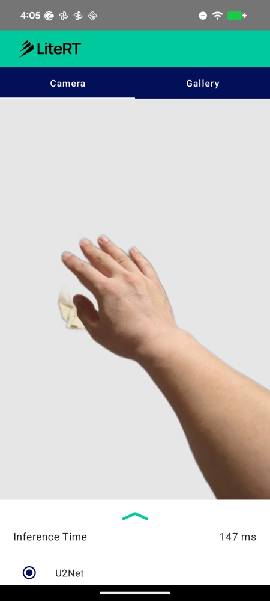

# LiteRT Background Removal Sample

This directory contains an Android background-removal (salient-object segmentation) sample demonstrating how to use LiteRT (Google's runtime for TensorFlow Lite) with the Compiled Model API. It runs [U²-Net](https://github.com/xuebinqin/U-2-Net) to separate the most salient foreground object from its background and produces a transparent cut-out.

## Overview

U²-Net is a nested U-structure ("U-net of U-nets", a pure CNN) that predicts a single-channel saliency mask in `[0, 1]` for the input image. The foreground (mask) is composited onto a transparent background to produce the cut-out result shown in the app.

The model is converted with [`litert-torch`](https://github.com/google-ai-edge/ai-edge-torch) and runs entirely on the Compiled Model API's CPU or GPU delegate — every op is GPU-native, so no part of the graph falls back to the CPU.

## Available Implementations

### 1. kotlin_cpu_gpu

A standard implementation utilizing the Compiled Model API with support for CPU and GPU delegates.

**Features:**
-   **Background removal**: Produces a transparent cut-out of the salient foreground object.
-   **Real-time inference**: Removes the background from the camera feed or a gallery image (Camera and Gallery tabs).
-   **Hardware acceleration**: Switch between CPU and GPU delegates at runtime.
-   **Fully GPU-native CNN**: The entire U²-Net graph runs on the Compiled Model GPU delegate.
-   **Jetpack Compose**: Modern Android UI toolkit.

### Screenshots

| Live background removal |
| :---: |
|  |

## Technical Details

### Model Architecture
-   **Task**: Salient-object segmentation / background removal.
-   **Model**: U²-Net (`u2net_fp16.tflite`), converted with `litert-torch` and float16-quantized.
-   **Input**: `[1, 3, 320, 320]` NCHW float32. Resized to 320×320, divided by the per-image max, then normalized with the ImageNet mean/std (`mean = [0.485, 0.456, 0.406]`, `std = [0.229, 0.224, 0.225]`).
-   **Output**: `[1, 1, 320, 320]` saliency mask in `[0, 1]` (sigmoid). The mask is upscaled to the input size and used as the alpha channel of the cut-out.
-   **Format**: TensorFlow Lite (`.tflite`), float16 weights (~88 MB).

### GPU compatibility notes
U²-Net is a pure CNN (Conv2d / BatchNorm / ReLU / MaxPool / bilinear-upsample / concat / sigmoid). It converts with `litert-torch` **without any custom rewrites** — all intermediate tensors stay 4-D and the graph compiles cleanly on the ML Drift GPU delegate. The float16 weights add `DEQUANTIZE` ops that the GPU delegate consumes natively.

### Key Dependencies
-   **LiteRT** (`com.google.ai.edge.litert:litert:2.1.5`)
-   **Jetpack Compose** (UI)
-   **CameraX** (Camera feed)

### Architecture Components
-   **`BackgroundRemovalHelper`**: Initializes the Compiled Model (CPU/GPU), preprocesses the image, runs U²-Net, and composites the foreground onto transparency.
-   **`MainActivity`**: Setup of the main screen and UI components.
-   **`CameraScreen` / `GalleryScreen`**: Composables for the camera preview and gallery input.
-   **`MainViewModel`**: Manages UI state and communicates between the UI and the Helper.

## Getting Started

1.  Open `kotlin_cpu_gpu/android` in Android Studio.
2.  The U²-Net model (`u2net_fp16.tflite`) is downloaded into `app/src/main/assets/` at build time by `download_model.gradle`.
3.  Build and run the application on an Android device.
4.  Point the camera at an object (or pick an image from the Gallery tab).
5.  Observe the foreground cut-out with the background removed.
6.  Use the settings sheet to switch between CPU and GPU acceleration.

## Model conversion & license

U²-Net is licensed under **Apache-2.0** (© the U²-Net authors, [xuebinqin/U-2-Net](https://github.com/xuebinqin/U-2-Net)). The `.tflite` is a format conversion of the official weights, produced with `litert-torch` (no architectural changes); all credit to the original authors.
