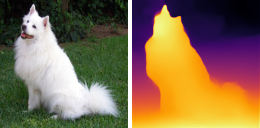
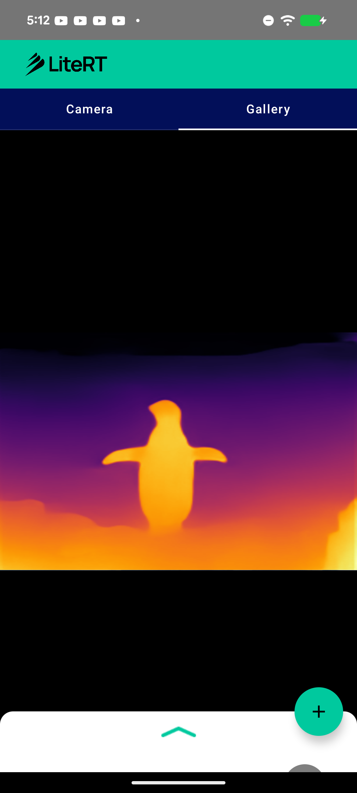

# LiteRT Monocular Depth Estimation Sample (MiDaS)

This directory contains an Android monocular **depth estimation** sample showing how to run a depth model with LiteRT (Google's runtime for TensorFlow Lite) on CPU and GPU. Given a single RGB image it predicts a per-pixel inverse-depth map (near = bright, far = dark).

Depth estimation is not yet covered by the `compiled_model_api` samples, so this adds a new task to the set.



## Overview

The model is **MiDaS v2.1 small** (`MiDaS_small`) — the CNN MiDaS with an EfficientNet-Lite3 backbone (not the DPT/ViT variants). It was chosen because it converts cleanly through the official `litert-torch` path with **no patches and no custom ops**, and lowers entirely to GPU-friendly builtins.

| | |
|---|---|
| Task | Monocular depth estimation |
| Model | MiDaS v2.1 small (EfficientNet-Lite3 backbone) |
| Source | `torch.hub.load("intel-isl/MiDaS", "MiDaS_small")` |
| License | MIT (MiDaS) / Apache-2.0 (EfficientNet-Lite backbone) |
| Input | `1 x 256 x 256 x 3` float32, RGB, ImageNet-normalized (NHWC) |
| Output | `1 x 256 x 256` float32, inverse depth (relative) |
| Size | 66 MB (fp32) / **33 MB (fp16, recommended)** |

## Model details

The converted graph uses only GPU-clean builtins — no `GATHER_ND`, no `>4D` reshapes, no Flex/Custom ops:

```
CONV_2D x73, ADD x27, DEPTHWISE_CONV_2D x24, RELU x7,
RESIZE_BILINEAR x5, RESHAPE x1
```

Numerical fidelity of the converted model vs. the original PyTorch model (FLOAT, real image): **corr 1.0000, max|diff| ~1.6e-3**. The fp16 model matches the fp32 model at **corr 0.9999998** (≈0.27 % of the depth range).

fp16 is recommended for the sample: half the size, runs natively on the GPU delegate, negligible quality loss. (Dynamic-range int8 favors the CPU/XNNPACK path, not the ML Drift GPU delegate, so it is not used here.)

**On-device (Pixel 8a, verified):** the fp16 model compiles to **234/234 nodes on the LiteRT GPU delegate (LITERT_CL)** — full GPU residency, no CPU fallback — and runs at ~1–3 ms/inference (best 1.1 ms). `RESIZE_BILINEAR align_corners=True` is GPU-supported as-is; no model change needed.

## Pre / post-processing

**Pre-processing** (`DepthEstimationHelper.preprocess`):
1. Resize the input to 256 x 256.
2. Normalize each channel with ImageNet statistics: `mean = [0.485, 0.456, 0.406]`, `std = [0.229, 0.224, 0.225]` on `[0,1]` pixels.
3. Write as interleaved NHWC `RGB` float32.

**Post-processing** (`DepthColorMap`):
1. Read the `256 x 256` inverse-depth output.
2. Min-max normalize to `[0,1]`.
3. Map through an `inferno` color LUT to an ARGB bitmap (near = bright).

## Available implementations

### kotlin_cpu_gpu



Standard implementation supporting CPU and GPU acceleration. The app shell (camera / gallery / Compose UI / Gradle) follows the same structure as the [`image_segmentation`](../image_segmentation) sample; the depth-specific logic lives in:

- **DepthEstimationHelper.kt** — CompiledModel setup, inference, ImageNet pre-processing.
- **DepthColorMap.kt** — inverse-depth → inferno color overlay.

**Performance on Pixel 8a (GPU):** 234/234 nodes on the LiteRT GPU delegate (LITERT_CL), ~1–3 ms / inference (fp16, best 1.1 ms) — full GPU residency, no CPU fallback.

## Model file

The `.tflite` is downloaded at build time (see `kotlin_cpu_gpu/android/app/download_model.gradle`) from [`litert-community/MiDaS-small`](https://huggingface.co/litert-community/MiDaS-small): `https://huggingface.co/litert-community/MiDaS-small/resolve/main/midas_small_256_fp16.tflite`.

## Reproducing the conversion

See [`conversion/`](conversion) — a self-contained script converts `MiDaS_small` to LiteRT with channel-last (NHWC) I/O and fp16 weights, and prints the op histogram + fidelity check.

```bash
python conversion/convert_midas_litert.py
```

## Key dependencies

- LiteRT (`com.google.ai.edge.litert`)
- Android CameraX, Jetpack Compose, Kotlin Coroutines

## Contributing

1. Follow existing code style and patterns.
2. Test on multiple devices and accelerators (finish with a real GPU `CompiledModel` compile).
3. Update documentation and include performance metrics.
