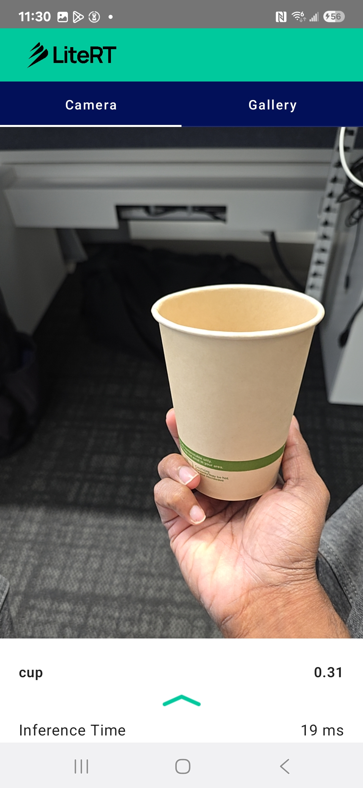
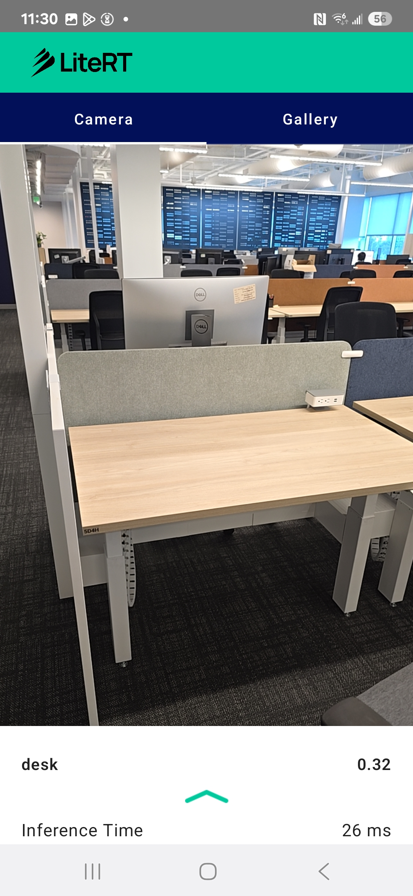

# LiteRT Image Classification Samples

This directory contains Android image classification samples demonstrating how to use LiteRT (Google's new runtime for TensorFlow Lite) with the Compiled Model API. The samples classify real-time camera feeds into standard ImageNet categories.

## Overview

The Image Classification samples allow users to classify objects in real-time using optimized machine learning models. It demonstrates the use of the LiteRT Compiled Model API with support for hardware acceleration (CPU and GPU delegates).

## Available Implementations

### 1. kotlin_cpu_gpu

A standard implementation utilizing the Compiled Model API with support for CPU and GPU delegates.

**Features:**
-   **Real-time Inference**: Classifies objects from the camera feed.
-   **Hardware Acceleration**: Switch between CPU and GPU delegates at runtime.
-   **Multiple Models**: Supports EfficientNet-Lite0 and EfficientNet-Lite2.
-   **Jetpack Compose**: Modern Android UI toolkit.

### Screenshots

| Object Classification | Object Classification |
| :---: | :---: |
|  |  |

## Technical Details

### Model Architecture
-   **Task**: Image Classification (ImageNet categories).
-   **Input**: 224x224x3 RGB image (preprocessed from camera stream).
-   **Output**: Probability scores for categories (loaded from metadata).
-   **Models**: 
    -   `efficientnet_lite0.tflite` (Default)
    -   `efficientnet_lite2.tflite`
-   **Format**: TensorFlow Lite (`.tflite`).

### Key Dependencies
-   **LiteRT** (`com.google.ai.edge.litert:litert:2.1.0`)
-   **LiteRT Support & Metadata** (`com.google.ai.edge.litert:litert-support:1.0.0`)
-   **Jetpack Compose** (UI)
-   **CameraX** (Camera feed)

### Architecture Components
-   **`ImageClassificationHelper`**: Handles model initialization, hardware delegate selection (CPU/GPU), and inference execution.
-   **`MainActivity`**: Setup of the main screen and UI components.
-   **`CameraScreen`**: Composable for camera preview and classification overlay.
-   **`MainViewModel`**: Manages UI state and communicates between the UI and the Helper.

## Getting Started

1.  Open `kotlin_cpu_gpu/android` in Android Studio.
2.  Build and run the application on an Android device.
3.  Point the camera at an object.
4.  Observe the classification results and confidence scores.
5.  Use the settings to change between CPU and GPU acceleration or switch models.
