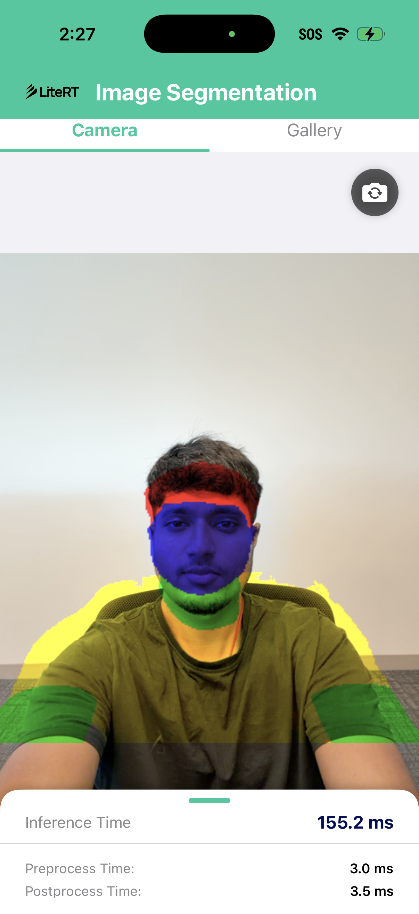
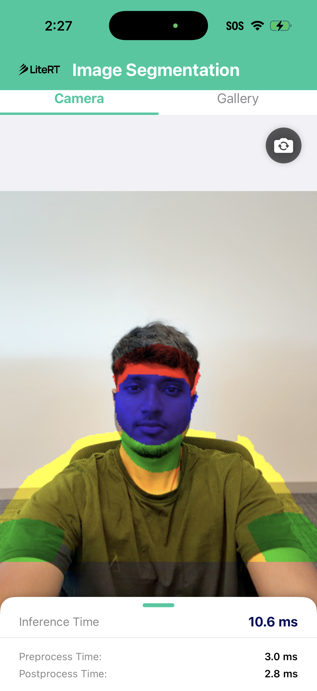

# LiteRT Image Segmentation - iOS (Clean App)

An iOS application demonstrating real-time and static image segmentation using LiteRT's Compiled Model API. The app performs multi-class segmentation on a bundled test image, allowing easy verification of CPU (Builtin Kernels) and GPU (Metal) execution.

## Screenshots

| CPU (Builtin Kernels) | GPU (Metal Accelerator) |
|---|---|
|  |  |

## Features

- **Backend Switching**: Select between CPU and GPU (Metal) directly in the UI.
- **Real-Time Camera Stream**: Run model inference live on camera feed with flipped-camera support.
- **Gallery Image Selection**: Import and segment custom images from your photo library.
- **XNNPACK Bypass**: Avoids delegate prepare allocation issues on iOS by running Builtin CPU Kernels.
- **GPU Acceleration**: Utilizes the dynamically loaded LiteRT Metal compiler plugin.
- **Static Verification**: Includes a bundled portrait sample image (`image.jpeg`) to immediately verify model compilation and inference on startup.
- **Performance Metrics Display**: Live measurements of pre-process, inference, and post-process execution times in milliseconds.

## Architecture

The app uses a Swift SwiftUI interface that bridges directly to a lightweight Objective-C++ wrapper (`LiteRTSegmenter.mm`) around LiteRT's C Compiled Model API.

| Component | File | Description |
|-----------|------|-------------|
| **LiteRTSegmenter** | `LiteRTSegmenter.mm` / `.h` | Objective-C++ bridge wrapping the LiteRT C API |
| **ContentView** | `ContentView.swift` | Single-page UI displaying original vs mask images, performance timing, and accelerator selection |
| **CameraManager** | `CameraManager.swift` | Manages AVFoundation camera capture session and frame streams |
| **ImagePicker** | `ImagePicker.swift` | Wraps PHPickerViewController in UIViewControllerRepresentable for photo library access |
| **ImageSegmentationApp** | `ImageSegmentationApp.swift` | Swift application entry point |
| **CLiteRT.xcframework** | `CLiteRT.xcframework` | Precompiled LiteRT C framework |
| **libLiteRtMetalAccelerator.dylib** | `libLiteRtMetalAccelerator.dylib` | Precompiled Metal compiler plugin |

---

## Prerequisites & Setup

### 1. Xcode & Project Configuration
1. Open the project `ImageSegmentation.xcodeproj` in Xcode.
2. Select the **ImageSegmentation** target.
3. In **Signing & Capabilities**, select your **Personal Team** profile. The bundle identifier is configured to `com.google.ai.edge.ImageSegmentation`.

### 2. Git LFS (Required for GPU Execution)
The Metal compiler plugin (`libLiteRtMetalAccelerator.dylib`) is stored in the LiteRT repository via **Git LFS**. Before running the app, install Git LFS and pull the actual binary slices (otherwise Xcode will package Git pointer text files, and `dlopen` will fail at runtime):
```bash
# Install Git LFS via Homebrew
brew install git-lfs

# Initialize LFS in your global Git config
git lfs install

# Navigate to your LiteRT submodule and pull the binary
cd path/to/LiteRT
git lfs pull
```

### 3. Building `CLiteRT.xcframework` from Source
The iOS application requires the `CLiteRT.xcframework` bundle to compile. Run the following Bazel command inside the LiteRT repository to build it from source:
```bash
# Navigate to the LiteRT repository
cd path/to/LiteRT

# Build the xcframework target for iOS (device and simulator slices)
bazel build -c opt --config=ios_arm64 //litert/swift:CLiteRT

# Copy the compiled xcframework bundle to the project directory
cp -R bazel-bin/litert/swift/CLiteRT.xcframework path/to/compiled_model_api/image_segmentation/ios/
```

---

## How It Works

### CPU Backend (Builtin Kernels)
Due to a shape calculation overflow crash in the default XNNPACK delegate during the `RESIZE_NEAREST_NEIGHBOR` operator allocation, CPU compilation is configured to bypass XNNPACK. 

The wrapper uses the internal LiteRT CPU options API to set the kernel execution mode to builtin:
```objc
LrtCpuOptions* cpu_opts = nullptr;
if (LrtCreateCpuOptions(&cpu_opts) == kLiteRtStatusOk) {
    LrtSetCpuOptionsKernelMode(cpu_opts, kLiteRtCpuKernelModeBuiltin);
    // Serialize and add options to LiteRtOptions...
}
```

### GPU Backend (Metal)
To compilation-verify and execute operations on GPU:
1. **Fallback bitmask**: The compilation options set a combined bitmask of `kLiteRtHwAcceleratorGpu | kLiteRtHwAcceleratorCpu`. This instructs LiteRT to compile supported operators for Metal and fall back to CPU for unsupported operators.
2. **Dynamic Loading**: Since the GPU registry loads accelerator plugins dynamically at runtime, the compiler plugin `libLiteRtMetalAccelerator.dylib` is bundled under the app's `Frameworks/` directory and signed.
3. **Library Directory Tag**: During environment creation, we pass the bundle's private frameworks folder path as `kLiteRtEnvOptionTagRuntimeLibraryDir` so the loader can locate the plugin:
```objc
NSString *frameworksPath = [[NSBundle mainBundle] privateFrameworksPath];
LiteRtEnvOption env_options[1];
env_options[0].tag = kLiteRtEnvOptionTagRuntimeLibraryDir;
env_options[0].value.type = kLiteRtAnyTypeString;
env_options[0].value.str_value = [frameworksPath UTF8String];
LiteRtStatus status = LiteRtCreateEnvironment(1, env_options, &_env);
```

---

## Model Information
* **Name**: `selfie_multiclass_256x256.tflite`
* **Source**: Official MediaPipe Selfie Multiclass model hosted on [Kaggle Models](https://www.kaggle.com/models/google/mediapipe/tfLite/selfie-multiclass-256x256).
* **Input**: `1 x 256 x 256 x 3` (normalized float32 values in `[-1.0, 1.0]`)
* **Output**: `1 x 256 x 256 x 6` (float32 values representing probabilities across 6 target segmentation classes)
