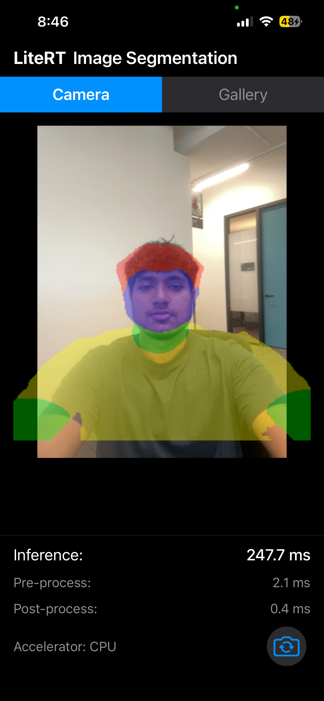

# LiteRT Image Segmentation - iOS

An iOS application demonstrating real-time image segmentation using LiteRT's
Compiled Model API. The app performs multi-class segmentation on camera frames
and gallery images, identifying and classifying objects at the pixel level.

## Screenshot

<p align="center">
  
</p>

## Features

- Real-time camera segmentation with front/back camera support
- Gallery image segmentation
- CPU acceleration via LiteRT Compiled Model API
- Segmentation mask overlay on input images
- Performance metrics display (inference, pre-process, post-process times)

## Architecture

The app uses an ObjC++ bridge layer to wrap the C++ LiteRT Compiled Model API
for Swift consumption, mirroring the Kotlin Android sample's architecture.

| Component | File | Description |
|-----------|------|-------------|
| **LiteRTSegmenter** | `LiteRTSegmenter.mm` / `.h` | ObjC++ bridge wrapping LiteRT C++ API |
| **SegmentationViewModel** | `SegmentationViewModel.swift` | State management and model lifecycle |
| **ContentView** | `ContentView.swift` | Main UI with camera/gallery tabs |
| **CameraManager** | `CameraManager.swift` | AVFoundation camera capture |
| **GalleryView** | `GalleryView.swift` | Photo picker for gallery segmentation |

### Pipeline

1. **Pre-process**: Resize input to 256x256, normalize pixel values to [-1, 1]
2. **Inference**: Run model via `litert::CompiledModel::Run()`
3. **Post-process**: Argmax across 6 channels, map to colored segmentation mask

## Model

- **Input**: 256x256x3 RGB image (float32)
- **Output**: 256x256x6 segmentation mask (float32)
- **File**: `selfie_multiclass_256x256.tflite`

## Prerequisites

- macOS with Xcode installed
- [Bazel](https://bazel.build/) 7.x
- An iOS device (for on-device testing)
- Apple Developer account (free account works for personal device testing)

> **Note**: The current version of `build_bazel_apple_support` has bugs that
> prevent iOS ObjC/ObjC++ builds with Bazel 7.x. You may need to patch
> `cc_toolchain_config.bzl` (add `objc_compile`/`objcpp_compile` to
> `compiler_input_flags`, add `objc_executable` to `_DYNAMIC_LINK_ACTIONS`)
> and `wrapped_clang.cc` (SDKROOT fallback), then point to the patched repo
> via `--override_repository=build_bazel_apple_support=/path/to/patched` in
> `.bazelrc.user`. These workarounds may not be needed in future versions.

### Build Command

```bash
bazel build //compiled_model_api/image_segmentation/ios:ImageSegmentationApp \
  --apple_platform_type=ios --cpu=ios_arm64
```

The output `.ipa` will be at:
```
bazel-bin/compiled_model_api/image_segmentation/ios/ImageSegmentationApp.ipa
```

### Install on Device

1. Extract the `.ipa`:
   ```bash
   unzip -o bazel-bin/compiled_model_api/image_segmentation/ios/ImageSegmentationApp.ipa -d /tmp/ImageSegmentationApp
   ```
2. Open Xcode > **Window > Devices and Simulators**
3. Select your device and click **+** under "Installed Apps"
4. Navigate to `/tmp/ImageSegmentationApp/Payload/ImageSegmentationApp.app`

### Device Signing

For on-device builds, you need a provisioning profile. Add the following to `BUILD`:

```python
ios_application(
    ...
    provisioning_profile = "your_profile.mobileprovision",
)
```

Update the `bundle_id` in both `BUILD` and `Info.plist` to match your provisioning profile.

## Key Dependencies

- [LiteRT](https://github.com/google-ai-edge/LiteRT) Compiled Model API (C++)
- SwiftUI
- AVFoundation (camera capture)
