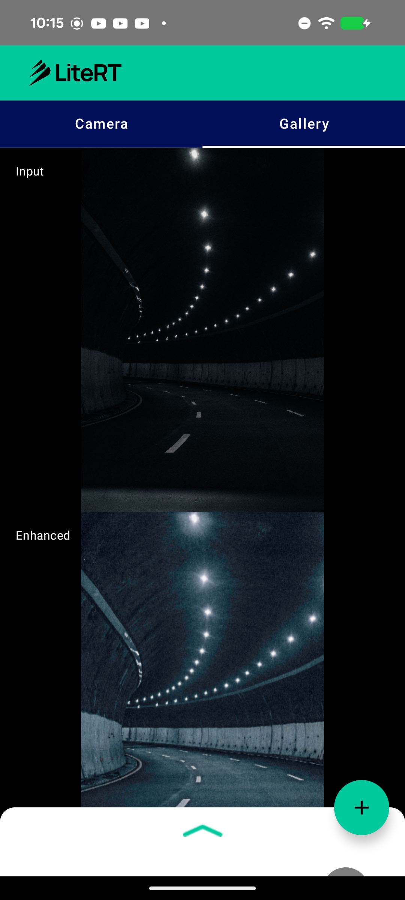

# LiteRT Low-Light Enhancement Sample (Zero-DCE)

This directory contains an Android **low-light image enhancement** sample showing how
to run an enhancement model with LiteRT (Google's runtime for TensorFlow Lite) on CPU
and GPU. Given a dark RGB image it predicts per-pixel tone curves and returns the
brightened image.

Low-light enhancement is not yet covered by the `compiled_model_api` samples, so this
adds a new task to the set.



## Overview

The model is **Zero-DCE** (Zero-Reference Deep Curve Estimation) — a tiny 7-layer CNN
(DCE-Net) that estimates pixel-wise tone curves. The curves are applied iteratively
(8×) as `x = x + r·(x² − x)` to brighten the image. The curve estimation **and** the
iterative application are both baked into the exported graph, so the model maps a dark
image straight to the enhanced one.

| | |
|---|---|
| Task | Low-light image enhancement |
| Model | Zero-DCE (DCE-Net, ~79K params) |
| Source | [`Li-Chongyi/Zero-DCE`](https://github.com/Li-Chongyi/Zero-DCE) |
| License | Apache-2.0 |
| Input | `1 x 512 x 512 x 3` float32, RGB, range `[0,1]` (NHWC) |
| Output | `1 x 512 x 512 x 3` float32, RGB, range `[0,1]` (enhanced) |
| Size | 0.34 MB (fp32) / **0.18 MB (fp16, recommended)** |

## Model details

The converted graph uses only GPU-clean builtins — the iterative curve application is
written as `x*x` so it lowers to `MUL`, not `POW`; no Flex/Custom ops, no `GATHER_ND`:

```
CONV_2D x7, MUL x16, SUB x8, ADD x8, SLICE x8, CONCATENATION x3, TANH x1
```

Numerical fidelity of the converted model vs. the original PyTorch model: **corr
1.0000, max|diff| ~2e-5**. The fp16 model matches the fp32 model at **corr 1.0000**.

**On-device (Pixel 8a, verified):** the fp16 model compiles to **58/58 nodes on the
LiteRT GPU delegate (LITERT_CL)** — full GPU residency, no CPU fallback.

## Pre / post-processing

**Pre-processing** (`EnhancementHelper.preprocess`):
1. Resize the input to 512 x 512.
2. Scale pixels to `[0,1]` (divide by 255 — **no** mean/std normalization).
3. Write as interleaved NHWC `RGB` float32.

**Post-processing** (`EnhancementHelper.postprocess`):
1. Read the `512 x 512 x 3` output in `[0,1]`.
2. Clamp and scale to `[0,255]`, pack as an ARGB bitmap.
3. Resize back to the source aspect ratio for display.

## Available implementations

### kotlin_cpu_gpu

Standard implementation supporting CPU and GPU acceleration. The app shell
(camera / gallery / Compose UI / Gradle) follows the same structure as the
[`image_segmentation`](../image_segmentation) sample; the enhancement-specific logic
lives in **EnhancementHelper.kt** (CompiledModel setup, inference, pre/post-processing).

**Performance on Pixel 8a (GPU):** 58/58 nodes on the LiteRT GPU delegate (LITERT_CL) —
full GPU residency, no CPU fallback.

## Model file

The `.tflite` is downloaded at build time (see
`kotlin_cpu_gpu/android/app/download_model.gradle`) from
[`litert-community/Zero-DCE`](https://huggingface.co/litert-community/Zero-DCE):
`https://huggingface.co/litert-community/Zero-DCE/resolve/main/zerodce_512_fp16.tflite`.

## Reproducing the conversion

See [`conversion/`](conversion) — a self-contained script converts Zero-DCE to LiteRT
with channel-last (NHWC) I/O and fp16 weights, and prints the op histogram.

```bash
python conversion/convert_zerodce_litert.py
```

## Key dependencies

- LiteRT (`com.google.ai.edge.litert`)
- Android CameraX, Jetpack Compose, Kotlin Coroutines

## Contributing

1. Follow existing code style and patterns.
2. Test on multiple devices and accelerators (finish with a real GPU
   `CompiledModel` compile).
3. Update documentation and include performance metrics.
