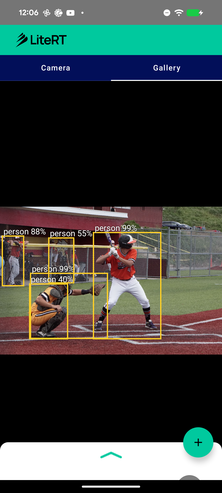

# LiteRT Object Detection Sample (SSDLite320-MobileNetV3)

This directory contains an Android **object detection** sample showing how to run a detector
with LiteRT (Google's runtime for TensorFlow Lite) on CPU and GPU. It runs torchvision's
[SSDLite320-MobileNetV3-Large](https://pytorch.org/vision/stable/models/generated/torchvision.models.detection.ssdlite320_mobilenet_v3_large.html)
to detect 90 COCO object classes and draws the labeled boxes over the input.

Object detection is not yet covered by the `compiled_model_api` samples, so this adds a new
task to the set — a lightweight (0.59 GMACs) detector that runs in real time on the GPU.



## Overview

The model outputs **raw detection-head tensors** — the **anchor decode + multiclass NMS are
done in Kotlin**, not in the graph. This keeps the graph GPU-clean and **fully GPU-resident**.

> Why this matters: SSD's built-in postprocess (`DefaultBoxGenerator` + box decode + NMS)
> lowers to `GATHER_ND` / `TOPK` / `>4D` tensors that the GPU delegate can't run. Tapping the
> 4D head conv outputs and keeping the decode in app code avoids that entirely. (The same
> conversion also keeps **NCHW** I/O — channel-last would blow MobileNetV3's SqueezeExcitation
> global-pools up to `GATHER_ND`.)

| | |
|---|---|
| Task | Object detection (90 COCO classes) |
| Model | SSDLite320-MobileNetV3-Large |
| Source | [`pytorch/vision`](https://github.com/pytorch/vision) (torchvision) |
| License | BSD-3-Clause |
| Input | `1 x 3 x 320 x 320` float32, RGB, `px / 127.5 - 1` (NCHW) |
| Output | 12 raw head tensors — `(cls, box)` per 6 levels (H = 20,10,5,3,2,1) |
| Size | **7.2 MB (fp16)** |

## Model details

The converted graph uses only GPU-clean builtins (no `GATHER` / `TOPK` / `CAST`, ≤4D tensors,
no dynamic dims):

```
CONV_2D x67, DEPTHWISE_CONV_2D x31, MUL x24, HARD_SWISH x20, TRANSPOSE x11,
ADD x10, RESHAPE x10, SUM x8, PAD x7
```

`SUM x8` are the MobileNetV3 SqueezeExcitation global-average-pools; `TRANSPOSE x11` are the
NCHW/NHWC shuffles. Both are accepted by the GPU delegate.

**On-device (Pixel 8a, Tensor G3, verified):** the fp16 model compiles to **286/286 nodes on
the LiteRT GPU delegate (LITERT_CL)** — 1 partition, full GPU residency, no CPU fallback — and
runs the live camera at **~30 FPS**.

## Pre / post-processing

**Pre-processing** (`ObjectDetectionHelper`):
1. Resize the input to 320 x 320 (bilinear stretch — SSD uses a fixed-size resize).
2. Normalize each pixel: `px / 127.5 - 1` → `[-1, 1]` (mean = std = 0.5, **not** ImageNet).
3. Write as NCHW RGB float32.

**Post-processing** (`ObjectDetectionHelper.decode`, in Kotlin — not in the graph). Mirrors
torchvision `SSD.postprocess_detections` + `BoxCoder(10, 10, 5, 5)`:
1. Rebuild the 3234 default boxes from the `DefaultBoxGenerator` formula (scales 0.2–0.95,
   aspect ratios {1, 2, 3, ½, ⅓}, 6 anchors/location).
2. Per anchor: softmax over the 91 classes → best non-background class → score threshold →
   decode `(dx, dy, dw, dh)` against the default box.
3. Per-class non-maximum suppression.
4. The UI (`DetectionOverlay`) draws each box + label inside the aspect-fit rectangle of the
   source so they line up with the displayed input.

The decode is numerically faithful: end-to-end it matches stock torchvision **298/300 boxes
@ IoU 0.99** on the fp16 model (see [`conversion/`](conversion)).

## Available implementations

### kotlin_cpu_gpu

Standard implementation supporting CPU and GPU acceleration. The app shell
(camera / gallery / Compose UI / Gradle) follows the same structure as the
[`pose_estimation`](../pose_estimation) sample; the detection-specific logic lives in
**ObjectDetectionHelper.kt** (inference + anchor decode + NMS) and **DetectionOverlay.kt**
(box drawing).

**Performance on Pixel 8a (GPU):** 286/286 nodes on the LiteRT GPU delegate (LITERT_CL) —
full GPU residency, no CPU fallback, ~30 FPS.

## Model file

The `.tflite` is downloaded at build time (see
`kotlin_cpu_gpu/android/app/download_model.gradle`) from
[`litert-community/ssdlite320-mobilenetv3-litert`](https://huggingface.co/litert-community/ssdlite320-mobilenetv3-litert):
`https://huggingface.co/litert-community/ssdlite320-mobilenetv3-litert/resolve/main/ssdlite_mobilenetv3_320_fp16.tflite`.

## Reproducing the conversion

See [`conversion/`](conversion) — a self-contained script converts SSDLite320-MobileNetV3 to
LiteRT (raw 4D detection heads, NCHW I/O, fp16 weights) and prints the op histogram and parity
vs PyTorch. A second script validates the Kotlin decode against stock torchvision.

```bash
python conversion/convert_ssdlite.py
python conversion/validate_decode.py
```

## Key dependencies

- LiteRT (`com.google.ai.edge.litert`)
- Android CameraX, Jetpack Compose, Kotlin Coroutines

## Contributing

1. Follow existing code style and patterns.
2. Test on multiple devices and accelerators (finish with a real GPU `CompiledModel` compile).
3. Update documentation and include performance metrics.
