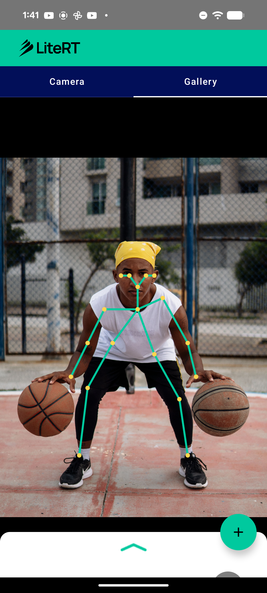

# LiteRT Pose Estimation Sample (lightweight-OpenPose)

This directory contains an Android **human pose estimation** sample showing how to run a
pose model with LiteRT (Google's runtime for TensorFlow Lite) on CPU and GPU. It runs
[lightweight-OpenPose](https://github.com/Daniil-Osokin/lightweight-human-pose-estimation.pytorch)
to predict body keypoints and draws the skeleton over the input.

Pose estimation is not yet covered by the `compiled_model_api` samples, so this adds a new
task to the set.



## Overview

The model is a MobileNet-based heatmap pose network. Crucially, **the model only outputs
keypoint heatmaps** — the keypoint **decoding (argmax over each heatmap) is done in Kotlin**,
not in the graph. This keeps the graph pure-conv and **fully GPU-resident**.

> Why this matters: the popular MoveNet `.tflite` bakes its keypoint decode into the graph
> (`GATHER_ND`), which the GPU delegate can't run — so it only partially offloads to the GPU
> and falls back to the CPU. Keeping the decode in app code avoids that entirely.

| | |
|---|---|
| Task | Single-person pose estimation (18 keypoints) |
| Model | lightweight-OpenPose (MobileNet backbone + refinement) |
| Source | [`Daniil-Osokin/lightweight-human-pose-estimation.pytorch`](https://github.com/Daniil-Osokin/lightweight-human-pose-estimation.pytorch) |
| License | Apache-2.0 |
| Input | `1 x 256 x 256 x 3` float32, RGB, `(px - 128) / 256` (NHWC) |
| Output | `1 x 32 x 32 x 19` float32, keypoint heatmaps (18 keypoints + background) |
| Size | 16.4 MB (fp32) / **8.3 MB (fp16, recommended)** |

## Model details

The converted graph uses only GPU-clean builtins (the `ELU` activations lower to
`EXP/SUB/GREATER_EQUAL/SELECT`, all GPU-supported):

```
CONV_2D x41, DEPTHWISE_CONV_2D x14, TRANSPOSE x14, EXP x6, SUB x6,
GREATER_EQUAL x6, SELECT x6, ADD x6, PAD x3, CONCATENATION x1
```

**On-device (Pixel 8a, verified):** the fp16 model compiles to **158/158 nodes on the
LiteRT GPU delegate (LITERT_CL)** — full GPU residency, no CPU fallback.

## Pre / post-processing

**Pre-processing** (`PoseHelper`):
1. Resize the input to 256 x 256.
2. Normalize each pixel: `(px - 128) / 256`.
3. Write as interleaved NHWC RGB float32.

**Post-processing** (`PoseHelper.decode`, in Kotlin — not in the graph):
1. For each of the 18 keypoint heatmaps, take the argmax over the `32 x 32` grid → a
   normalized `[0,1]` keypoint with a confidence score.
2. The UI (`PoseOverlay`) draws the skeleton edges and keypoints, placed inside the
   aspect-fit rectangle of the source so they line up with the displayed input.

## Available implementations

### kotlin_cpu_gpu

Standard implementation supporting CPU and GPU acceleration. The app shell
(camera / gallery / Compose UI / Gradle) follows the same structure as the
[`image_segmentation`](../image_segmentation) sample; the pose-specific logic lives in
**PoseHelper.kt** (inference + heatmap decode) and **PoseOverlay.kt** (skeleton drawing).

**Performance on Pixel 8a (GPU):** 158/158 nodes on the LiteRT GPU delegate (LITERT_CL) —
full GPU residency, no CPU fallback.

## Model file

The `.tflite` is downloaded at build time (see
`kotlin_cpu_gpu/android/app/download_model.gradle`) from
[`mlboydaisuke/lightweight-openpose-litert`](https://huggingface.co/mlboydaisuke/lightweight-openpose-litert):
`https://huggingface.co/mlboydaisuke/lightweight-openpose-litert/resolve/main/pose_256_fp16.tflite`.

## Reproducing the conversion

See [`conversion/`](conversion) — a self-contained script converts lightweight-OpenPose to
LiteRT (heatmaps-only output, channel-last NHWC I/O, fp16 weights) and prints the op histogram.

```bash
python conversion/convert_pose_litert.py
```

## Key dependencies

- LiteRT (`com.google.ai.edge.litert`)
- Android CameraX, Jetpack Compose, Kotlin Coroutines

## Contributing

1. Follow existing code style and patterns.
2. Test on multiple devices and accelerators (finish with a real GPU
   `CompiledModel` compile).
3. Update documentation and include performance metrics.
