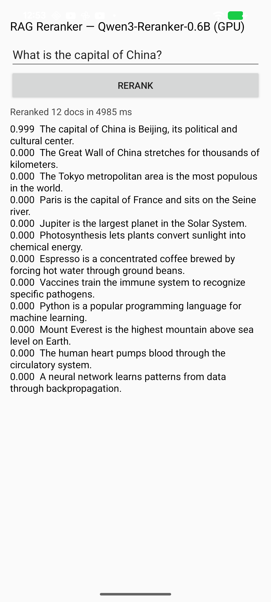

# Reranking — on-device RAG reranker with Qwen3-Reranker-0.6B (fully GPU)

An Android app that reranks candidate documents for a query **entirely on the LiteRT `CompiledModel`
GPU** with [Qwen3-Reranker-0.6B](https://huggingface.co/Qwen/Qwen3-Reranker-0.6B) (Apache-2.0), the
2025 SOTA small reranker. It scores each document by relevance (`P("yes")`) and reorders them — the
reranking half of an on-device RAG pipeline (retrieval is the sibling `semantic_similarity` sample).

Reranking is a **single forward pass** (no generation, no KV cache), so the model is a plain
single-graph `.tflite` on the standard GPU path.

Converted graph: [`litert-community/Qwen3-Reranker-0.6B-LiteRT`](https://huggingface.co/litert-community/Qwen3-Reranker-0.6B-LiteRT).



## Result (Pixel 8a / Tensor G3)

- all nodes on the GPU delegate (zero CPU fallback), `P(yes)` parity **ref 0.9995 / dev 0.9994** vs HF
- query *"What is the capital of China?"* → *"…Beijing…"* **0.999**, every other document **0.000**

## How it scores

```
prompt = PREFIX + "<Instruct>:… <Query>:… <Document>:…" + SUFFIX     (Qwen3-Reranker template)
       →[host embed lookup]→ inputs_embeds[1,256,1024]
       →[GPU: 28-layer decoder + baked 2-logit head]→ logits[1,256,2]
       →[softmax over (no,yes) at the last real token]→ P(yes)
```

The 2-logit head bakes the tied-embedding rows for `"no"` (2152) / `"yes"` (9693). The host right-pads
and pools the last real token (causal ⇒ identical to the official left-pad + mask). Token embedding is
a GATHER (GPU-banned) so it is host-side.

## Model files

Download from Hugging Face and stage into the app's private `filesDir`:

```bash
huggingface-cli download litert-community/Qwen3-Reranker-0.6B-LiteRT \
    qwen3rerank_gpu_fp16.tflite embeddings_fp16.bin --local-dir /tmp/qwen3rerank
adb shell run-as com.google.ai.edge.examples.reranking mkdir -p files
for f in qwen3rerank_gpu_fp16.tflite embeddings_fp16.bin; do
  adb push /tmp/qwen3rerank/$f /data/local/tmp/$f
  adb shell run-as com.google.ai.edge.examples.reranking cp /data/local/tmp/$f files/$f
done
```

Tokenizer (`vocab.json`, `merges.txt`) and demo `docs.txt` are bundled in `assets/`.

## Build & run

```bash
cd kotlin_cpu_gpu/android
./gradlew :app:installDebug
# stage the model files (above), then launch
```

`minSdk 26`, `arm64-v8a`, LiteRT `CompiledModel` GPU.

## Conversion

The GPU-clean re-authoring (host-embed, GQA `cat`-repeat, max-normalized RMSNorm for the deep-stack
fp16 overflow, baked RoPE / causal mask, baked yes/no head) is reproducible in
[`conversion/`](conversion/). Same graph as the embedder — only the head differs.
