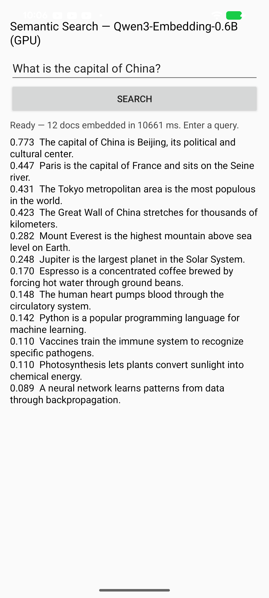

# Semantic Similarity — on-device text embeddings with Qwen3-Embedding-0.6B (fully GPU)

An Android app that computes text embeddings **entirely on the LiteRT `CompiledModel` GPU** with [Qwen3-Embedding-0.6B](https://huggingface.co/Qwen/Qwen3-Embedding-0.6B) (Apache-2.0), the 2025 SOTA small text-embedding model, and ranks a bundled document set against a typed query by cosine similarity — the retrieval half of an on-device RAG pipeline.

Sentence embedding uses **last-token pooling of a single forward pass** (no generation, no KV cache), so the model is a plain single-graph `.tflite` on the same GPU path as any CNN/ViT.

Converted graph: [`litert-community/Qwen3-Embedding-0.6B-LiteRT`](https://huggingface.co/litert-community/Qwen3-Embedding-0.6B-LiteRT).



## Result (Pixel 8a / Tensor G3)

| | |
|---|---|
| GPU delegate | **3264 / 3264 nodes on LITERT_CL** (zero CPU fallback) |
| Inference | ~390 ms per embedding |
| Size | fp16 881 MB graph + 310 MB embedding table |
| Parity vs HF fp32 | cosine **0.9997** |

Query *"What is the capital of China?"* → *"The capital of China is Beijing"* at **0.77**, unrelated documents below **0.1**.

## Pipeline

```
text →[BPE tokenize]→ ids →[host embed lookup]→ inputs_embeds[1,128,1024]
     →[GPU: 28-layer Qwen3 decoder]→ hidden[1,128,1024]
     →[pool last token + L2-normalize (+ optional Matryoshka 1024→N)]→ embedding
     →[cosine]→ ranked documents
```

The token-embedding lookup is a GATHER (GPU-banned), so it runs on the host and is fed in as `inputs_embeds`, like mel/log-mel preprocessing in the audio samples.

## Model files

The two large artifacts are **not bundled** in the APK. Download them from Hugging Face and stage them into the app's private `filesDir`:

```bash
huggingface-cli download litert-community/Qwen3-Embedding-0.6B-LiteRT \
    qwen3emb_gpu_fp16.tflite embeddings_fp16.bin --local-dir /tmp/qwen3emb

adb shell run-as com.google.ai.edge.examples.semantic_similarity mkdir -p files
for f in qwen3emb_gpu_fp16.tflite embeddings_fp16.bin; do
  adb push /tmp/qwen3emb/$f /data/local/tmp/$f
  adb shell run-as com.google.ai.edge.examples.semantic_similarity cp /data/local/tmp/$f files/$f
done
```

The tokenizer (`vocab.json`, `merges.txt`) and the demo `corpus.txt` are bundled in `assets/`.

## Build & run

```bash
cd kotlin_cpu_gpu/android
./gradlew :app:installDebug
# stage the model files (above), then launch the app
```

`minSdk 26`, `arm64-v8a`, LiteRT `CompiledModel` GPU. First launch compiles the GPU program (~one minute, one-time) and embeds the demo corpus, then ranks any query you type.

## Conversion

The GPU-compatible re-authoring — host-side embedding, GQA `cat`-repeat (to avoid `BROADCAST_TO`), max-normalized RMSNorm for the deep-stack fp16 overflow, baked RoPE / causal mask — is fully reproducible in [`conversion/`](conversion/) (`build_qwen3emb.py`, `export_embeddings.py`, plus a device-parity harness).

> There is also a native C++ embedding sample under [`build_from_source/`](build_from_source/).
