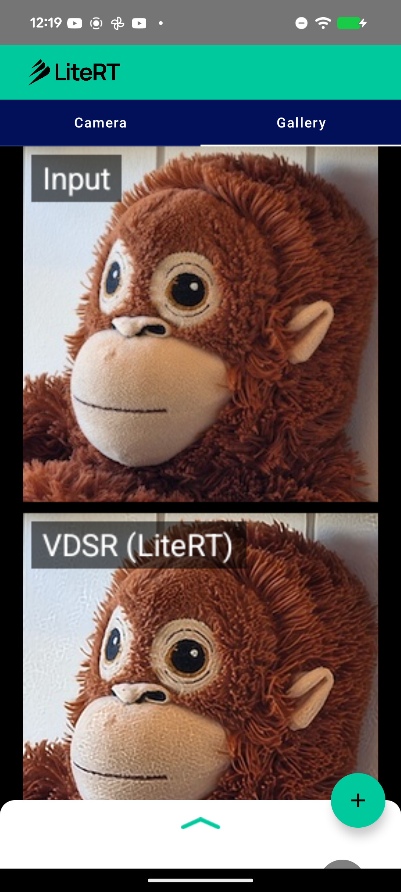

# LiteRT Super-Resolution Sample (VDSR)

This directory contains an Android **single-image super-resolution** sample showing how
to run an SR model with LiteRT (Google's runtime for TensorFlow Lite) on CPU and GPU.
It runs [VDSR](https://cv.snu.ac.kr/research/VDSR/) (Very Deep Super-Resolution, CVPR'16)
to sharpen an image, and shows the input and the VDSR result stacked for comparison.

Super-resolution is not yet covered by the `compiled_model_api` samples, so this adds a
new task to the set.



## Overview

VDSR is a 20-layer CNN that refines the **luminance (Y)** of an image and adds a global
residual. It operates at the display resolution (no in-network upsampling layer), so the
graph is just `conv + ReLU + a residual add` — no PixelShuffle, no PReLU, no attention.
That is exactly why it converts and runs **fully on the GPU delegate** (many SR models
use PixelShuffle / PReLU, which are GPU-hostile through the PyTorch path).

| | |
|---|---|
| Task | Single-image super-resolution |
| Model | VDSR (Very Deep Super-Resolution, 20-layer CNN) |
| Source | [`twtygqyy/pytorch-vdsr`](https://github.com/twtygqyy/pytorch-vdsr) (`model_epoch_50.pth`) |
| License | MIT |
| Input | `1 x 256 x 256 x 1` float32, luminance (Y), range `[0,1]` |
| Output | `1 x 256 x 256 x 1` float32, refined luminance (Y), range `[0,1]` |
| Size | 2.68 MB (fp32) / **1.35 MB (fp16, recommended)** |

## Model details

The converted graph uses only GPU-clean builtins:

```
CONV_2D x19, DEPTHWISE_CONV_2D x1, ADD x1
```

Numerical fidelity of the converted model vs. the original PyTorch model: **corr 1.0000**.
The fp16 model matches the fp32 model closely (corr 1.0000).

**On-device (Pixel 8a, verified):** the fp16 model compiles to **41/41 nodes on the
LiteRT GPU delegate (LITERT_CL)** — full GPU residency, no CPU fallback.

## Pre / post-processing

VDSR works on luminance only, so the app converts to YCbCr, super-resolves Y, and keeps
the chroma:

**Pre-processing** (`SuperResolutionHelper`):
1. Resize the input to 256 x 256.
2. Convert to YCbCr (BT.601); feed the `Y` channel (scaled to `[0,1]`) as `1 x 256 x 256 x 1`.

**Post-processing:**
1. Read the refined `Y` (`[0,1]`).
2. Recombine with the original `Cb`/`Cr` and convert back to RGB.
3. Stack the input over the VDSR result (with captions) into one comparison bitmap.

## Available implementations

### kotlin_cpu_gpu

Standard implementation supporting CPU and GPU acceleration. The app shell
(camera / gallery / Compose UI / Gradle) follows the same structure as the
[`image_segmentation`](../image_segmentation) sample; the SR-specific logic lives in
**SuperResolutionHelper.kt** (CompiledModel setup, the YCbCr pipeline, and the
input-vs-VDSR comparison).

**Performance on Pixel 8a (GPU):** 41/41 nodes on the LiteRT GPU delegate (LITERT_CL) —
full GPU residency, no CPU fallback.

## Model file

The `.tflite` is downloaded at build time (see
`kotlin_cpu_gpu/android/app/download_model.gradle`) from
[`mlboydaisuke/vdsr-litert`](https://huggingface.co/mlboydaisuke/vdsr-litert):
`https://huggingface.co/mlboydaisuke/vdsr-litert/resolve/main/vdsr_256_fp16.tflite`.

## Reproducing the conversion

See [`conversion/`](conversion) — a self-contained script converts VDSR to LiteRT with
channel-last (NHWC) I/O and fp16 weights, and prints the op histogram.

```bash
python conversion/convert_vdsr_litert.py
```

## Key dependencies

- LiteRT (`com.google.ai.edge.litert`)
- Android CameraX, Jetpack Compose, Kotlin Coroutines

## Contributing

1. Follow existing code style and patterns.
2. Test on multiple devices and accelerators (finish with a real GPU
   `CompiledModel` compile).
3. Update documentation and include performance metrics.
