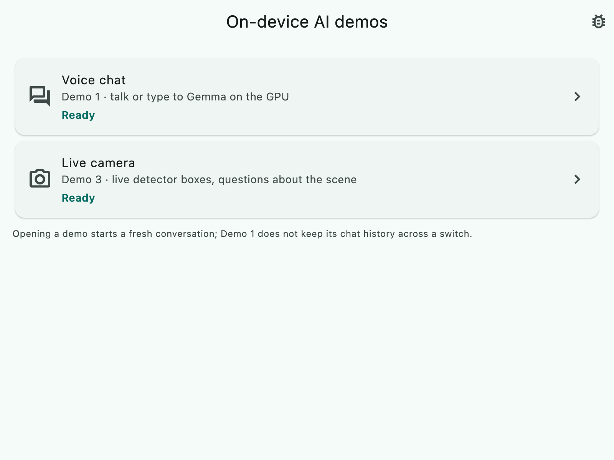
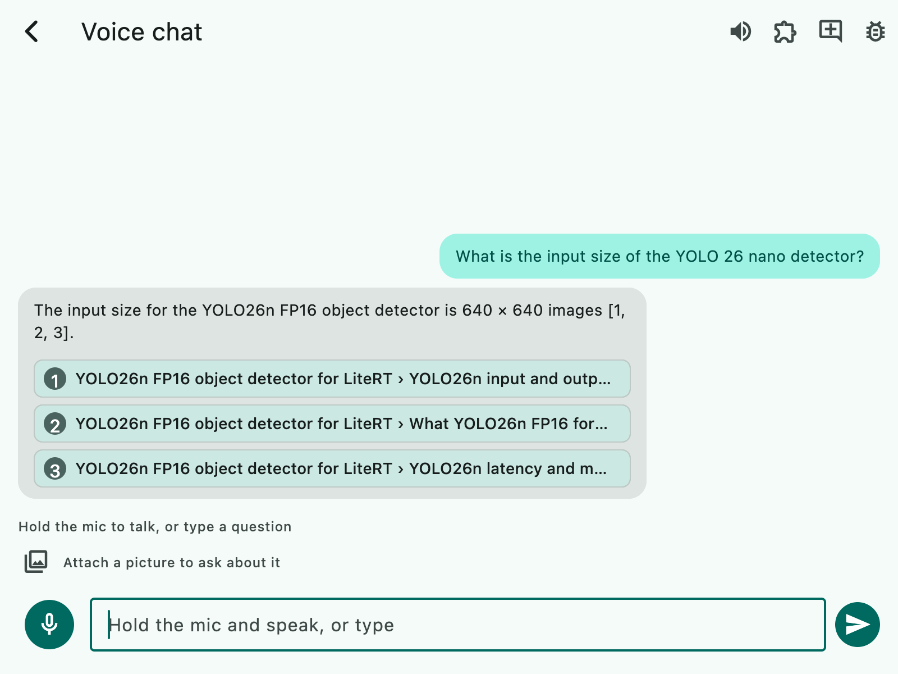
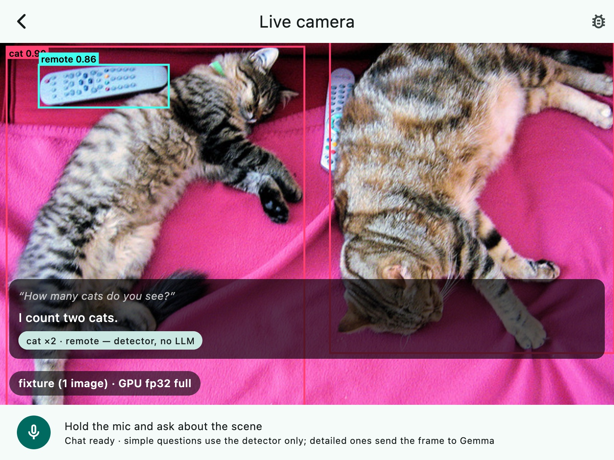

# LiteRT Demos (Flutter)

One Flutter app with two on-device AI demos for Android, iOS, macOS and Linux. Everything runs on the device: a chat
model through LiteRT-LM (Gemma 4 E2B on the GPU, CPU or a Qualcomm NPU), speech in and out, a local knowledge base
and a LiteRT object detector. Once the chat model is on the device, the app needs no network.

| Home | Voice chat | Live camera |
|---|---|---|
|  |  |  |

- **Voice chat.** Hold the mic button and ask; Whisper base transcribes, the chat model streams the answer, and
  Inflect-nano-v2 speaks it from the first finished sentence. Attach a photo and ask about it. Questions about LiteRT
  and the Flutter packages are answered from a built-in knowledge base (EmbeddingGemma-300M and sqlite-vec) with
  citation chips. Agent skills come from Markdown files (`SKILL.md`) and can be added at run time without a rebuild:
  the current time, and device and accelerator info (the chip, the GPU and where each model runs).
- **Live camera.** Live boxes from a YOLO26n detector on the GPU. Ask by voice (moonshine tiny): simple questions
  ("How many cats do you see?") are answered from the detections without the LLM; detailed ones ("Describe the
  scene", "What does the sign say?") send the current frame to the chat model.

The app is built on [`flutter_edge_ai`](https://pub.dev/packages/flutter_edge_ai) (formerly `flutter_gemma`) and its
LiteRT-LM, speech, embeddings, RAG and agent packages, plus [`flutter_litert`](https://pub.dev/packages/flutter_litert)
for the detector. Both are community packages, not Google SDKs. How the pieces fit:
[docs/architecture.md](docs/architecture.md).

## Platform guides

This README covers what every platform shares. Each guide has the device-specific build, install and run steps:

| Platform | Guide |
|---|---|
| Android phones (Android 11+, arm64), including the Qualcomm NPU | [../android](../android/README.md) |
| iPhone (iOS 26+) | [../ios](../ios/README.md) |
| Raspberry Pi 5 | [../raspberry](../raspberry/README.md) |
| NVIDIA Jetson Orin | [../nvidia](../nvidia/README.md) |
| Arduino VENTUNO Q (Qualcomm QCS8275), including the NPU | [../qualcomm/ventuno](../qualcomm/ventuno/README.md) |

macOS (Apple silicon) and Linux desktops run from this folder directly ([Run](#run)).

## Requirements

| | |
|---|---|
| Flutter | 3.47.3 (Dart 3.13), stable channel. [fvm](https://fvm.app) users get it from `.fvmrc` |
| Python | 3.10 to 3.14 with `venv`, used once by `tool/fetch_models.sh` to derive the detector model. macOS ships 3.9: install a newer one (for example `brew install python@3.12`) and run `PYTHON=python3.12 tool/fetch_models.sh` |
| Hugging Face | an account that accepted the Gemma terms for [litert-community/embeddinggemma-300m](https://huggingface.co/litert-community/embeddinggemma-300m), and a read token |
| Disk | about 400 MB for the built-in models (plus a Python venv under `build/`), 2.6 GB for the chat model, and the build output |
| macOS | Xcode 26 and CocoaPods; Apple silicon, macOS 14 or newer |
| Linux | x64 or arm64, Ubuntu 22.04+ / Debian 12+; a Vulkan GPU for GPU inference; the packages below |
| Android, iOS | see the platform guides |

On Linux, install the build and runtime packages first:

```sh
sudo apt install git curl unzip xz-utils patch python3-venv clang cmake ninja-build pkg-config lld \
  libgtk-3-dev liblzma-dev libstdc++-12-dev libgstreamer1.0-dev libgstreamer-plugins-base1.0-dev \
  libasound2-dev libturbojpeg pulseaudio-utils gstreamer1.0-plugins-base gstreamer1.0-plugins-good
```

On Debian and Raspberry Pi OS the JPEG library is `libturbojpeg0`; on Ubuntu 22.04 add `libunwind-dev`.

## Set up (once per checkout)

```sh
tool/flutter_litert/vendor.sh        # flutter_litert 3.9.3 + a small patch into third_party/ (gitignored)
cp .env.example .env                 # then put your token in it: HF_TOKEN=hf_...
tool/fetch_models.sh                 # the built-in models into assets/models/, each one verified
flutter pub get
```

- **`vendor.sh`.** On Linux, `flutter_litert` must run on the same LiteRT library as LiteRT-LM (one LiteRT per
  process). The patch makes it do that, and changes nothing on the other platforms. `pubspec.yaml` points
  `dependency_overrides` at the patched copy, so `flutter pub get` fails until this has run.
- **`fetch_models.sh`.** The models built into the app are not in git. [`tool/models.lock`](tool/models.lock) pins
  every file (repository, commit, path, size and SHA-256); the script resumes interrupted downloads, skips files it
  has already verified, and `--check` verifies without the network. Until it has run, every `flutter build`, `run`
  and `test` fails with "No file or variants found for asset: assets/models/…".
- **The token** is sent only with the gated EmbeddingGemma download and never enters a build.
- **The detector model is derived, not downloaded.** The script downloads Arm's
  [`yolo26n_conv2d_f16_weights.tflite`](https://huggingface.co/Arm/yolo26n-fp16-litert) and cuts its head with
  [`tool/prune_yolo26n_head.py`](tool/prune_yolo26n_head.py) in a venv under `build/`, so the whole graph runs on the
  GPU. The output must match the lock byte for byte. If you were given `yolo26n_fp16_rawhead.tflite`, put it in
  `assets/models/` first: the script then verifies it and skips the derivation.
- **The first build** of each platform downloads native prebuilts: the LiteRT-LM runtime built by the
  `flutter_edge_ai` project (a GitHub release, SHA-256 checked) and, because `pubspec.yaml` sets
  `qualcomm_npu: true`, Qualcomm's QNN runtime for the NPU (Android: from Maven Central; Linux arm64: read out of
  Qualcomm's public QAIRT SDK zip). Both are checked against pinned SHA-256 values; the QNN libraries are under
  Qualcomm's licence. Set `qualcomm_npu: false` to build without them.

## The chat model

The app ships no chat model: it loads the `.litertlm` file you choose. Start with Gemma 4 E2B from
[litert-community/gemma-4-E2B-it-litert-lm](https://huggingface.co/litert-community/gemma-4-E2B-it-litert-lm) (no
login needed): `gemma-4-E2B-it.litertlm` (2.6 GB) runs on the GPU or CPU everywhere. The same repository has NPU
builds compiled ahead of time for one chip each; this app runs the Qualcomm ones, on that chip:
`…_qualcomm_sm8750.litertlm` on a Snapdragon 8 Elite phone, `…_qualcomm_qcs8275.litertlm` on a QCS8275 board. The
Google Tensor and Intel builds and the text-only `-gpu` and `-web` files are not supported.

Start the app once, then put the file in its models folder and choose it on **Set up models › Chat model** (later
**Home › More › Models**):

| Platform | Models folder |
|---|---|
| Android | `/data/local/tmp/litert-models` (`adb push`) or `/sdcard/Android/data/com.google.ai.edge.examples.litert_edge_demos/files/models` |
| iOS | the app's Documents/models (visible in the Files app) |
| macOS | the app's Documents/models (`~/Library/Containers/com.google.ai.edge.examples.litertEdgeDemos/Data/Documents/models`) |
| Linux | `~/litert-demos/models` |

**Download from URL…** takes a direct link (for example
`https://huggingface.co/litert-community/gemma-4-E2B-it-litert-lm/resolve/main/gemma-4-E2B-it.litertlm`).
**Import file…** (iOS and desktop) copies a file in. **Path…** uses a file where it is; a macOS build is sandboxed
and can read only its own container.

The card's starting settings, for a file used in place: the backend and image support come from the file's header
(an NPU-only build starts on the NPU where the NPU is offered; a file with a vision encoder starts with images on),
the context length and prompt format from the file name (`_ekv4096_`; otherwise 8192 tokens on the GPU or CPU, 4096
on the NPU). Most official NPU builds do not mark themselves NPU-only, so select **NPU** yourself. A downloaded or
imported file starts on the NPU where it is offered, otherwise the GPU, with images and tools off. Change any of it
on the card.

## Run

Use a release or profile build: debug builds run the Dart side of the pipelines much slower.

```sh
flutter devices
flutter run -d <device-id> --release
```

- **macOS:** `flutter run -d macos --release`.
- **Linux:** `NO_XIPH_LIBS=1 flutter run -d linux --release` (`NO_XIPH_LIBS` leaves out the audio player's codec
  libraries, which exist only for x64; the app plays raw PCM). For the pre-flight launcher, which checks the sound
  server, microphone, speaker, Vulkan GPU and camera and says what to install, package a release build:

  ```sh
  NO_XIPH_LIBS=1 flutter build linux --release
  tool/linux/package.sh        # build/dist/litert_edge_demos-v<version>-linux-<arch>/ and a .tar.gz
  ```

  Then run `./run.sh` inside that folder.

Grant the camera and microphone when asked. The first launch on the GPU is slower than later ones: the runtimes
compile GPU programs once and cache them.

## Using the demos

- **Voice chat:** hold the mic button, speak, release; or type. Try "What is the input size of the YOLO26 nano
  detector?" (answered from the knowledge base, with sources), "Which accelerator are you running on?" and a
  question about an attached photo. Skills live in the folder the Skills sheet shows; add a folder with a `SKILL.md`
  and press **Reload**.
- **Live camera:** pick the camera source in the demo's settings (the tune icon; the **Camera** button on Linux):
  the device camera, or a network camera. Hold the mic and ask, within 5 seconds, "What do you see?", "How many
  people are there?", "Describe the scene". The chip under the answer says which route answered it.
- **Network camera:** a multipart MJPEG stream, for example an Android phone running the free IP Webcam app on the
  same Wi-Fi: tap **Start server** and enter the address it shows followed by `/video`
  (`http://192.168.1.23:8080/video`). The URL is stored on the device, and an `http` stream is not encrypted: do not
  put a password you use elsewhere in it.

The app never moves a model to another backend on its own. If a requested GPU or NPU cannot be used, it says so and
offers another backend as an explicit choice. **This device** (on Home) and the diagnostics overlay show the backend
each model asked for and, where the runtime reports it, the one it got.

## Self-test and diagnostics

`--selftest` probes the hardware, runs the detector on a reference picture against golden detections, loads the chat
model and times 64 tokens, runs the detector again to check it is unchanged, plays a tone and records one second,
then writes a report: device, OS, GPU and driver, where each model ran, speed and memory. On Linux run
`./run.sh --selftest` (add `--skip-audio` without a microphone or speaker); everywhere, **Home › More › Models ›
Run self-test** does the same in the app. **This device › Copy diagnostics** copies the same facts to the clipboard.

## Configuration

Everything has a default; these dart-defines change it (`flutter run --dart-define=NAME=value`):

| Define | Effect |
|---|---|
| `GEMMA_MODEL_PATH` | a `.litertlm` to use as the chat model while none is chosen in the app (integration tests, headless self-test) |
| `DETECTOR_BACKEND` | `gpu` or `cpu` for the detector, fixed for the build (otherwise the Live camera setting, default GPU) |
| `FRAME_SOURCE` | `camera` (default), `network` or `fixture` |
| `NETWORK_CAMERA_URL` | the stream for `FRAME_SOURCE=network` |
| `FIXTURE_DIR` | a folder of images to play as the camera for `FRAME_SOURCE=fixture` |
| `VOICE_GATE_DBFS` | the microphone's silence threshold, for a noisy room |

Tunables (frame rate, voice gate, prompts, knowledge-base settings) are in `lib/config/`.

## Models and licences

| Role | Model | Where it comes from | Licence |
|---|---|---|---|
| Chat | Gemma 4 E2B, or any supported `.litertlm` | you choose it in the app | Gemma 4: Apache-2.0 |
| Speech to text (Voice chat) | Whisper base, int8 | [litert-community/whisper-base](https://huggingface.co/litert-community/whisper-base) | Apache-2.0 |
| Speech to text (Live camera) | moonshine tiny | [litert-community/moonshine-tiny](https://huggingface.co/litert-community/moonshine-tiny) | MIT |
| Text to speech | Inflect-nano-v2 (fp16), with Matcha's G2P | [litert-community/Inflect-Nano-v2](https://huggingface.co/litert-community/Inflect-Nano-v2), [litert-community/Matcha-TTS](https://huggingface.co/litert-community/Matcha-TTS) | Apache-2.0; G2P model and config MIT; `g2p_dict.txt.gz` BSD-3-Clause-Clear (OpenPhonemizer) |
| Embeddings | EmbeddingGemma-300M | [litert-community/embeddinggemma-300m](https://huggingface.co/litert-community/embeddinggemma-300m) (gated) | [Gemma Terms of Use](https://ai.google.dev/gemma/terms) |
| Detector | YOLO26n, raw head | derived from [Arm/yolo26n-fp16-litert](https://huggingface.co/Arm/yolo26n-fp16-litert) (Ultralytics YOLO26) | AGPL-3.0 |
| NPU runtime | Qualcomm QNN runtime (HTP), with LiteRT's Qualcomm dispatch library | fetched at build time (`qualcomm_npu: true`) | QNN: Qualcomm's licence (redistribution inside an app); dispatch: Apache-2.0 |

Every built-in model is fetched by `tool/fetch_models.sh`, none is in git; [assets/models/NOTICE.md](assets/models/NOTICE.md)
and the in-app licence page (**Home › More › Licences**) list them with their sources.

- **YOLO26n is AGPL-3.0.** The weights are Ultralytics YOLO26 ([docs](https://docs.ultralytics.com/models/yolo26/),
  [licence](https://github.com/ultralytics/ultralytics/blob/main/LICENSE)), converted to LiteRT by Arm. The derived
  file is built on your machine and bundled into your build: if you distribute that build, the AGPL-3.0 applies to
  it. To avoid that, replace the detector with an Apache-licensed one (see `lib/data/services/detector/`).
- **EmbeddingGemma** is distributed under the Gemma Terms of Use and its
  [Prohibited Use Policy](https://ai.google.dev/gemma/prohibited_use_policy); every build carries it.
- The knowledge base (`assets/kb/`, indexed into `assets/kb_index/` by `tool/build_kb_index.sh`) lists each
  document's source and licence in its front matter.

## Tests

```sh
flutter analyze
flutter test                                                        # unit and widget tests
flutter test integration_test/<file>.dart -d <device-id> --dart-define=GEMMA_MODEL_PATH=<path/to/model.litertlm>
```

Each integration test's header lists its flags; most run on macOS (`-d macos`), where the sandboxed debug build
reads files given by path (the model, fixture folders) only from `~/Downloads`. Run integration tests on devices
with `flutter test`, not `flutter drive`.

The questions the integration tests play into the microphone (`test_assets/q_*.wav`, `test_assets/france_16k.pcm`,
`test_assets/showcase/q_*.wav`) are spoken by the app's own speech synthesizer, Inflect-nano-v2. The wording lives in
one list at the top of `integration_test/tools/make_question_audio_test.dart`; `tool/make_question_audio.sh`
regenerates them on a Mac.

## Known limitations

- **Half-duplex audio by design:** the microphone is closed while a reply plays; pressing it interrupts the reply.
  There is no echo cancellation.
- **iOS 26 or newer:** a dependency of the agent package (`flutter_inappwebview_ios`) links a system library that
  first ships in iOS 26, so on older iOS the app stops at launch.
- **Speech models run on the CPU** everywhere; the GPU and NPU are used by the chat model and the detector.
