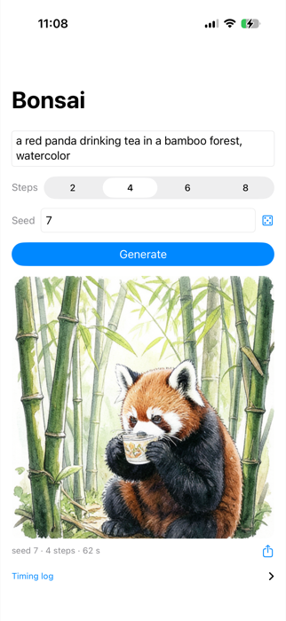
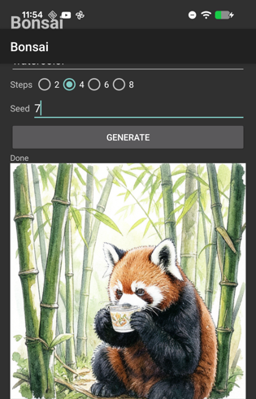

# LiteRT Image Generation (Text-to-Image)

Fully on-device text-to-image generation with [Bonsai Image 4B](https://huggingface.co/litert-community/Bonsai-Image-ternary-4B), a ternary-weight diffusion transformer (FLUX.2-klein-4B architecture) converted to LiteRT. The whole pipeline runs in three fixed-shape `.tflite` graphs (Qwen3 text encoder, DiT, VAE decoder) on CPU via XNNPACK — no server, no torch. Prompt in, 512×512 PNG out.

## Screenshots

The demo apps on both platforms, generating from the same prompt and the same seed — the apps share a bit-identical seeded-noise stream, so seed 7 draws the same red panda on an iPhone and a Pixel:

| iOS (iPhone 17 Pro, ~62 s) | Android (Pixel 8a) |
|---|---|
|  |  |

## Where things live

- **Python host sample** (tokenize + FlowMatch-Euler loop + unpatchify, ~150 lines): [`models/bonsai/bonsai_image_4b`](../../../models/bonsai/bonsai_image_4b) in this repo.
- **iOS / macOS demo apps (SwiftUI)**: [`ios/`](ios/) and [`macos/`](macos/) in this directory — single-screen apps with on-device Qwen3 tokenization (byte-level BPE, token-exact against the Python tokenizer), seed control, progress, cancel, and share.
- **Android demo app (Kotlin)**: [hf-to-litertlm/bonsai_image_work/device/BonsaiAppAndroid](https://github.com/john-rocky/hf-to-litertlm/tree/main/bonsai_image_work/device/BonsaiAppAndroid) — the same single-screen app, sharing the bit-identical seeded-noise stream with the iOS app. It lives outside this repo for now: a 4-step 512×512 run takes ~7 minutes on a Pixel 8a, so it is a proof-of-run rather than a polished sample.
- **Model files**: [model card](https://huggingface.co/litert-community/Bonsai-Image-ternary-4B) (int4 DiT 2.11 GiB + int4-DRQ text encoder 1.68 GiB + fp32 VAE 0.19 GiB).

## Measured (smallest set, 512×512, 4 steps)

| Device | DiT step | total |
|---|---|---|
| Apple M4 Max (Python sample) | 3.9–4.0 s | ~20 s |
| iPhone 17 Pro | 12–13 s | ~62 s |
| Pixel 8a | 78–88 s | ~7.1 min |

Peak memory is ~2.9 GiB — the three graphs load sequentially and are freed between stages. Details and the cross-platform seeded-reproducibility notes are in the demo apps' READMEs.
