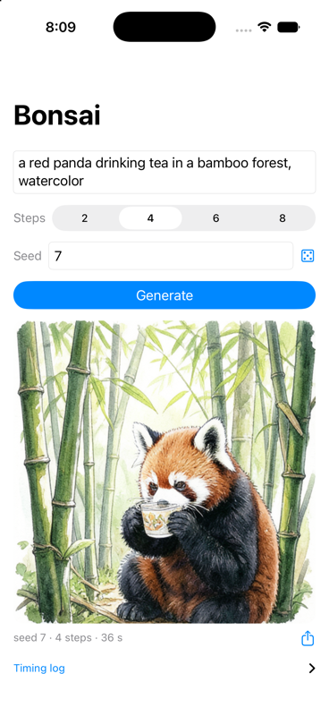

# Bonsai Image 4B Text-to-Image - iOS

An iOS application demonstrating fully on-device text-to-image generation with [Bonsai Image 4B](https://huggingface.co/litert-community/Bonsai-Image-ternary-4B), a ternary-weight diffusion transformer (FLUX.2-klein-4B architecture) converted to LiteRT. The entire pipeline runs on the phone: Qwen3 tokenization (pure Swift), text encoding, the FlowMatch-Euler diffusion loop, and VAE decoding — three fixed-shape `.tflite` graphs on CPU via XNNPACK, no server, no torch.

## Screenshot

## Features

- **Fully on-device**: prompt in, 512×512 PNG out; airplane mode works.
- **Arbitrary prompts**: byte-level BPE Qwen3 tokenizer implemented in Swift (verified token-exact against the Python `transformers` tokenizer on a 26-case golden set covering CJK, emoji, NFD, and whitespace edges).
- **Seeded generation**: reproducible images per (prompt, seed, steps) on the same device.
- **Step control**: the model is 4-step distilled; 2–8 steps selectable.
- **Progress + cancel**: per-stage progress with a cancel that stops after the current DiT step.
- **Memory-safe sequencing**: the three graphs load and free one at a time, so peak footprint stays near the DiT size (~2.9 GiB on iPhone 17 Pro) instead of the ~4 GiB sum.
- **CLI-drivable**: launch arguments / environment variables trigger a headless generation for `simctl`/`devicectl` automation (see `device_run.sh`).

## Architecture

| Component | File | Description |
|-----------|------|-------------|
| **QwenTokenizer** | `Sources/QwenTokenizer.swift` | Byte-level BPE (vocab.json + merges.txt) + structural chat template |
| **BonsaiMath** | `Sources/BonsaiMath.swift` | Sigma schedule, position ids, seeded Gaussian noise, latent unpatchify — all cross-checked on the Mac against recorded pipeline fixtures |
| **BonsaiPipeline** | `Sources/BonsaiPipeline.swift` | Sequential three-graph execution over the classic TFLite C API with an explicit XNNPACK delegate |
|  **ImageGenerationApp** | `Sources/BonsaiApp.swift` | SwiftUI: prompt, steps, seed, progress, image, share |
| **CLiteRT bridge** | `../BonsaiDeviceTest/CLiteRT/` | Bridging header + C helpers (XNNPACK delegate creation, classic C API declarations) |

## Prerequisites & Setup

1. **Resources**: `./prep_resources.sh` copies the tokenizer tables (`vocab.json`, `merges.txt`) and `pipeline_meta.json` from the model download into `Resources/` (bundled with the app, not committed).
2. **Project**: `xcodegen generate` (project spec in `project.yml`), then open `ImageGeneration.xcodeproj` and set your signing team.
3. **Models**: download from [litert-community/Bonsai-Image-ternary-4B](https://huggingface.co/litert-community/Bonsai-Image-ternary-4B) and copy `dit_int4b32.tflite`, `textenc_int4.tflite`, `vae_dec_fp32.tflite` (3.97 GiB total — the smallest set: int4 DiT + int4 DRQ text encoder) into the app's **Documents** folder, either via Finder file sharing over **USB** (Wi-Fi transfers can truncate multi-GiB files) or via `devicectl device copy to … --domain-type appDataContainer` (exact command in `device_run.sh`). The app lists any missing files on launch; Documents persist across app updates, so this is a one-time transfer per device.
4. Run a **Release** build (Debug tanks XNNPACK throughput).

`device_run.sh` does install + headless launch on a connected device in one step.

## How It Works

- **Tokenization**: the graph input is `[<|im_start|>]` + BPE(`"user\n"` + prompt) + a fixed assistant suffix — structurally identical to `transformers.apply_chat_template(..., enable_thinking=False)`. The `"user\n"` prefix must be BPE'd together with the prompt: a prompt starting with whitespace merges tokens across that boundary.
- **XNNPACK is a correctness requirement here, not an optimization**: this runtime build does not auto-apply the delegate through the classic C API, and the reference-kernel fallback is both ~100× slower and numerically wrong for blockwise int4 weights. The delegate is attached explicitly with the thread count in its options.
- **Host math**: the FlowMatch-Euler update, the empirical-mu sigma schedule, and the BatchNorm-affine + 2×2 unpatchify were ported from the Python sample and verified on the Mac against recorded pipeline fixtures (Euler+unpatchify max error 9.5e-7) — device runs never debug math, only the runtime.
- **Model file names**: resolved from `pipeline_meta.json` with a `_fixed` fallback (the zero-scale-patched DiT used during device verification).

## Model Information

| Graph | File | Recipe | Size |
|---|---|---|---|
| DiT (3.88 B, ternary weights) | `dit_int4b32.tflite` | int4 block-32 | 2.11 GiB |
| Text encoder (Qwen3-4B, pruned) | `textenc_int4.tflite` | int4 block-128 DRQ | 1.68 GiB |
| VAE decoder | `vae_dec_fp32.tflite` | fp32 | 0.19 GiB |

Source and conversion details: [model card](https://huggingface.co/litert-community/Bonsai-Image-ternary-4B).

## Performance

| Environment | DiT step | total (4 steps, 512×512) |
|---|---|---|
| iPhone 17 Pro (CPU/XNNPACK, 6 threads) | 13 s | ~64 s, ~2.9 GiB peak |
| iOS Simulator on Apple silicon | 6.6 s | ~36 s |

