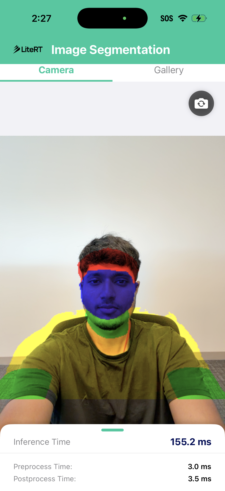
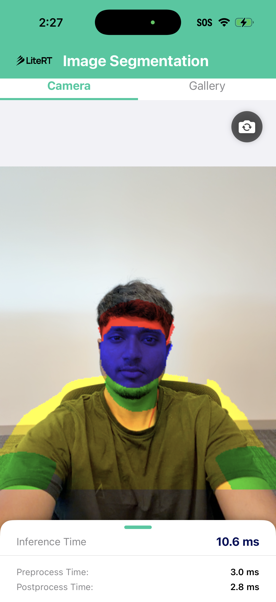

# LiteRT Image Segmentation - iOS

An iOS application demonstrating real-time and static image segmentation using LiteRT's Compiled Model API. The app performs multi-class segmentation on a bundled test image, allowing easy verification of CPU (XNNPACK) and GPU (Metal) execution.

## Screenshots

| CPU (XNNPACK) | GPU (Metal Accelerator) |
|---|---|
|  |  |

## Features

- **Backend Switching**: Select between CPU (XNNPACK) and GPU (Metal) directly in the UI.
- **Real-Time Camera Stream**: Run model inference live on camera feed with flipped-camera support.
- **Gallery Image Selection**: Import and segment custom images from your photo library.
- **CPU Acceleration**: Uses high-performance multi-threaded XNNPACK acceleration for CPU execution.
- **GPU Acceleration**: Utilizes the dynamically loaded LiteRT Metal compiler plugin.
- **Static Verification**: Includes a bundled portrait sample image (`image.jpeg`) to immediately verify model compilation and inference on startup.
- **Performance Metrics Display**: Live measurements of pre-process, inference, and post-process execution times in milliseconds.

## Architecture

The app uses a SwiftUI interface paired with a pure Swift implementation (`LiteRTSegmenter.swift`) that interacts directly with the LiteRT Swift Package. This eliminates the need for an Objective-C++ bridging header and provides a native, type-safe API for model compilation and inference.

| Component | File | Description |
|-----------|------|-------------|
| **LiteRTSegmenter** | `LiteRTSegmenter.swift` | Native Swift implementation utilizing LiteRT Swift bindings (`Environment`, `Options`, `CpuOptions`, `CompiledModel`, `TensorBuffer`) |
| **ContentView** | `ContentView.swift` | Single-page UI displaying original vs mask images, performance timing, and accelerator selection |
| **CameraManager** | `CameraManager.swift` | Manages AVFoundation camera capture session and frame streams |
| **ImagePicker** | `ImagePicker.swift` | Wraps PHPickerViewController in UIViewControllerRepresentable for photo library access |
| **ImageSegmentationApp** | `ImageSegmentationApp.swift` | Swift application entry point |
| **LiteRT** (Swift Package Product) | `LiteRT/Package.swift` (`CLiteRT.xcframework`) | LiteRT Swift bindings and precompiled C framework |
| **LiteRtMetalAccelerator** (Swift Package Product) | `LiteRT/Package.swift` (`LiteRtMetalAccelerator.xcframework`) | Standalone Metal GPU accelerator framework embedded into `ImageSegmentation.app/Frameworks/` |

---

## Prerequisites & Setup

### 1. Xcode & Project Configuration
1. Open the project `ImageSegmentation.xcodeproj` in Xcode.
2. Select the **ImageSegmentation** target.
3. In **Signing & Capabilities**, select your **Personal Team** profile. The bundle identifier is configured to `com.google.ai.edge.ImageSegmentation`.

### 2. Building `CLiteRT` and `LiteRtMetalAccelerator` XCFrameworks from Source
The iOS application links the `LiteRT` and `LiteRtMetalAccelerator` products from the local `LiteRT` Swift Package (`LiteRT/Package.swift`), which consume `prebuilt/CLiteRT.xcframework.zip` and `prebuilt/LiteRtMetalAccelerator.xcframework.zip`. Run the following Bazel commands inside the `LiteRT` repository to build both `.xcframework` archives:
```bash
# Navigate to the LiteRT repository
cd path/to/LiteRT

# Build the CLiteRT and standalone LiteRtMetalAccelerator xcframework targets for iOS (device and simulator slices)
bazel build -c opt //litert/swift:CLiteRT //litert/swift:LiteRtMetalAccelerator

# Copy the compiled xcframework archives into LiteRT/prebuilt/ for the Swift Package
mkdir -p prebuilt
cp -f bazel-bin/litert/swift/CLiteRT.xcframework.zip prebuilt/
cp -f bazel-bin/litert/swift/LiteRtMetalAccelerator.xcframework.zip prebuilt/
```

---

## How It Works

### CPU Backend (XNNPACK)
CPU compilation uses the `LiteRT` Swift API (`Options` and `CpuOptions`), configuring XNNPACK delegate execution with 4 threads:

```swift
let options = try Options()
try options.setHardwareAccelerators([.cpu])

let cpuOptions = try CpuOptions()
try cpuOptions.setKernelMode(.delegate)
try cpuOptions.setNumThreads(4)
try options.addConcreteOptions(cpuOptions)
```

### GPU Backend (Metal)
To compile and execute operations on the Metal GPU backend:
1. **Standalone `LiteRtMetalAccelerator.xcframework`**: Built via `bazel build -c opt //litert/swift:LiteRtMetalAccelerator`, linked and embedded into the app bundle (`Frameworks/LiteRtMetalAccelerator.framework/LiteRtMetalAccelerator`).
2. **Automatic Environment Discovery**: When `try Environment()` is initialized in Swift, `Environment.swift` automatically locates `LiteRtMetalAccelerator.framework/LiteRtMetalAccelerator` inside the app bundle's `Frameworks/` directory and passes its path as `.runtimeLibraryDir`.
3. **Hardware Accelerator Options**: Setting `[.gpu, .cpu]` instructs LiteRT to delegate supported operations to the dynamically loaded `LiteRtMetalAccelerator` plugin and fall back to CPU for unsupported operations:
```swift
let environment = try Environment()
let options = try Options()
try options.setHardwareAccelerators([.gpu, .cpu])
let compiledModel = try CompiledModel(
    filePath: modelPath,
    environment: environment,
    options: options
)
```

---

## Model Information
* **Name**: `selfie_multiclass_256x256.tflite`
* **Source**: Official MediaPipe Selfie Multiclass model hosted on [Kaggle Models](https://www.kaggle.com/models/google/mediapipe/tfLite/selfie-multiclass-256x256).
* **Input**: `1 x 256 x 256 x 3` (normalized float32 values in `[-1.0, 1.0]`)
* **Output**: `1 x 256 x 256 x 6` (float32 values representing probabilities across 6 target segmentation classes)
