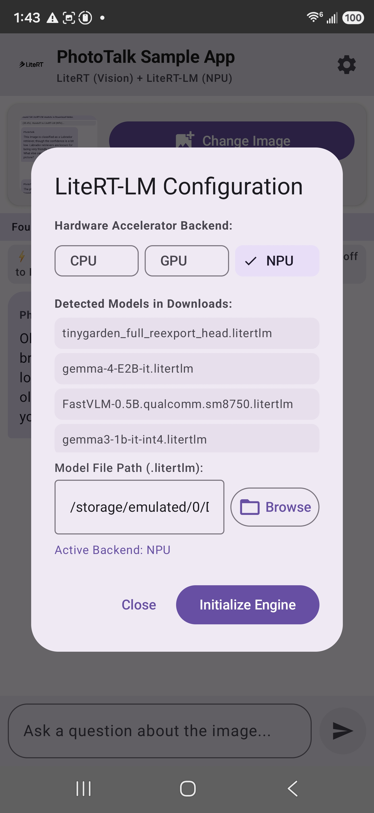
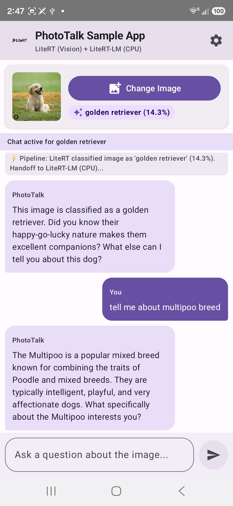
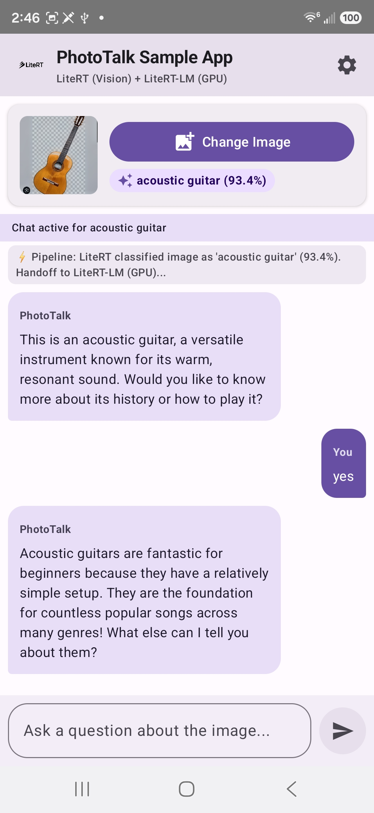

# **PhotoTalk Sample App: Co-dependent LiteRT & LiteRT-LM Sample**

**PhotoTalk Sample App** is an Android sample application demonstrating the side-by-side co-dependent integration of **LiteRT** (for classic machine learning image classification) and **LiteRT-LM** (for Large Language Model orchestration).

---

## **Architecture & Co-dependency Pattern**

On-device Vision Language Models (VLMs) can be memory-intensive on mobile devices. **PhotoTalk Sample App** uses an efficient two-stage pipeline to achieve interactive image-based conversation with minimal latency and memory footprint:

```
┌──────────────────────────┐
│   User Image / Photo     │
└────────────┬─────────────┘
             │
             ▼
┌──────────────────────────┐
│  LiteRT (CompiledModel)  │ ◄── EfficientNet-Lite0 Image Classifier (TFLite)
└────────────┬─────────────┘
             │
             │ Extracted Label (e.g. "Electric Guitar", 94%)
             ▼
┌──────────────────────────┐
│        Prompting         │ ◄── Context handoff: "User uploaded photo of [Label]..."
└────────────┬─────────────┘
             │
             ▼
┌──────────────────────────┐
│   LiteRT-LM (Engine)     │ ◄── On-Device LLM (Gemma 3 1B / Gemma 4 / FastVLM)
└────────────┬─────────────┘
             │
             ▼
┌──────────────────────────┐
│ Interactive Chat Session │ ◄── Concise, interactive multi-turn Q&A about the image
└────────────┬─────────────┘
```

1. **LiteRT 2.2.0 (Image Classification)**: Uses the LiteRT `CompiledModel` API with **EfficientNet-Lite0** (`efficientnet_lite0.tflite`) to classify an uploaded image and extract the top detected object label.
2. **Context Handoff**: The detected label and confidence score are injected into the system instruction for LiteRT-LM.
3. **LiteRT-LM 0.16.1 (Interactive Chat)**: Creates a `Conversation` session with hardware acceleration (NPU, GPU, or CPU). The LLM greets the user with concise insights about the identified object and streams interactive multi-turn answers.

---

## **Hardware Acceleration Backends**

PhotoTalk supports three hardware execution backends selectable from the in-app **Settings (⚙️)**:

| Backend | Accelerator | Description | Best Suited Models |
|:---|:---|:---|:---|
| **NPU** | Qualcomm Hexagon DSP (HTP v79 / v75 / v73) | Direct hardware acceleration via Qualcomm QNN HTP dispatch runtime. | `Gemma3-1B-IT_q4_ekv1280_sm8750.litertlm`, `FastVLM-0.5B.sm8750.litertlm` |
| **GPU** | Adreno / Mali (OpenCL / Vulkan) | Low-latency compute shaders across mobile GPU execution units. | `gemma-4-E2B-it.litertlm`, `Gemma3-1B-IT` |
| **CPU** | Kryo / Cortex Multi-core | Portable execution using XNNPACK CPU acceleration. | Universal compatibility |

---

## **Supported Model Zoo**

PhotoTalk automatically scans your device's `/sdcard/Download/` folder for compatible `.litertlm` models:

| Model | Parameters | Quantization | Size | Target Hardware | Source |
|:---|:---:|:---:|:---:|:---|:---|
| **Gemma 3 1B IT** | 1B | 4-bit (`q4_ekv1280`) | ~657 MB | NPU (SM8750), GPU | [Hugging Face](https://huggingface.co/litert-community/Gemma3-1B-IT) |
| **Gemma 4 E2B IT** | 2B | 4-bit | ~2.4 GB | GPU, CPU | [Hugging Face](https://huggingface.co/litert-community/gemma-4-E2B-it-litert-lm) |
| **FastVLM 0.5B** | 0.5B | 4-bit | ~900 MB | NPU (SM8750), GPU | [Hugging Face](https://huggingface.co/litert-community/FastVLM-0.5B) |

---

## **Screenshots**

| LiteRT-LM Configuration Settings | CPU Accelerator Inference | GPU Accelerator Inference |
|:---:|:---:|:---:|
|  |  |  |

---

## **Key Code Highlights**

### 1. Vision Classification with LiteRT `CompiledModel`
```kotlin
// ImageClassifierHelper.kt
val options = CompiledModel.Options(Accelerator.GPU)
val model = CompiledModel.create(assetManager, "efficientnet_lite0.tflite", options, null)

val inputBuffer = TensorBuffer.createFixedSize(intArrayOf(1, 224, 224, 3), DataType.FLOAT32)
inputBuffer.loadBuffer(preprocessBitmap(bitmap))

val outputBuffer = TensorBuffer.createFixedSize(intArrayOf(1, 1001), DataType.FLOAT32)
model.run(arrayOf(inputBuffer.buffer), arrayOf(outputBuffer.buffer))
```

### 2. Initializing LiteRT-LM Engine with Hardware Backend
```kotlin
// LiteRtLmHelper.kt
val engineConfig = EngineConfig(
    modelPath = modelPath,
    backend = when (preferredBackend) {
        "NPU" -> Backend.NPU(nativeLibraryDir = context.applicationInfo.nativeLibraryDir)
        "GPU" -> Backend.GPU()
        else -> Backend.CPU()
    }
)
val engine = Engine.create(engineConfig)
```

### 3. Context Injection & Streaming Chat Flow
```kotlin
// LiteRtLmHelper.kt
val config = ConversationConfig(
    systemInstruction = Contents.of(
        "You are PhotoTalk, a concise visual assistant. " +
        "The user uploaded an image classified as '$detectedLabel'. " +
        "Keep answers short (max 2 sentences) and provide helpful context."
    )
)
val conversation = engine.createConversation(config)

// Stream responses cleanly via MessageCallback
private fun sendMessageAsFlow(conv: Conversation, prompt: String): Flow<String> = callbackFlow {
    conv.sendMessageAsync(prompt, object : MessageCallback {
        override fun onMessage(message: Message) { trySend(message.toString()) }
        override fun onDone() { close() }
        override fun onError(throwable: Throwable) { close(throwable) }
    })
    awaitClose { }
}
```

---

## **Project Structure**

```
phototalk_sample_app/
├── README.md
├── output/                              # Screenshots (settings.jpg, CPU.jpg, GPU.jpg)
└── android/
    ├── app/
    │   ├── build.gradle.kts
    │   ├── download_model.gradle        # Automated download for EfficientNet-Lite0
    │   └── src/main/
    │       ├── AndroidManifest.xml
    │       ├── res/                     # Resources & LiteRT branding
    │       └── java/com/google/aiedge/examples/phototalk/
    │           ├── MainActivity.kt
    │           ├── MainViewModel.kt
    │           ├── ImageClassifierHelper.kt  # LiteRT CompiledModel classifier
    │           ├── LiteRtLmHelper.kt         # LiteRT-LM Engine & Conversation manager
    │           └── ui/                       # Jetpack Compose UI (PhotoTalkAppScreen.kt)
    ├── download_npu_libs.sh             # Helper script to download Qualcomm NPU runtime libs
    ├── build.gradle.kts
    ├── settings.gradle.kts
    └── gradle/libs.versions.toml
```

---

## **Developer Setup & Getting Started**

### **1. Prerequisites**
* Android Studio (Ladybug 2024.2.1+ or newer)
* Android device with **Android 8.0+ (API 26+)** (for Qualcomm NPU: Snapdragon 8 Gen 3 / Snapdragon 8 Elite / SM8750 recommended)
* Android SDK & NDK installed

---

### **2. Setup NPU Runtime Libraries (Optional for Qualcomm NPU)**
If you want to run LiteRT-LM on Qualcomm Hexagon NPUs, run the helper script in the `android/` directory:

```bash
cd samples/litert/phototalk_sample_app/android
bash download_npu_libs.sh
```

This downloads the official [LiteRT 2.2.0 NPU Runtime Libraries](https://github.com/google-ai-edge/LiteRT/releases/download/v2.2.0/litert_npu_runtime_libraries.zip) and packages the required Qualcomm QNN binaries (`libQnnHtp.so`, `libLiteRtDispatch_Qualcomm.so`, `libQnnHtpV79Skel.so`, etc.) into `app/src/main/jniLibs/arm64-v8a/`.

> **Note**: Native `.so` libraries are excluded from Git via `.gitignore`. Running `download_npu_libs.sh` prepares them locally for build.

---

### **3. Download and Push a `.litertlm` Model to the Device**
Download your preferred on-device LLM from [Hugging Face](https://huggingface.co/litert-community) and push it to your device's `/sdcard/Download/` folder:

* **For Qualcomm NPU Acceleration (Gemma 3 1B)**:
  ```bash
  adb push Gemma3-1B-IT_q4_ekv1280_sm8750.litertlm /sdcard/Download/
  ```

* **For GPU & CPU Acceleration (Gemma 4 2B)**:
  ```bash
  adb push gemma-4-E2B-it.litertlm /sdcard/Download/
  ```

---

### **4. Build & Install the Application**

```bash
cd samples/litert/phototalk_sample_app/android
./gradlew installDebug
```

---

### **5. Running the App**
1. Launch **PhotoTalk Sample App** on your phone.
2. Tap the **Settings (⚙️)** icon in the top right.
3. Select your model file and preferred accelerator backend (**NPU**, **GPU**, or **CPU**).
4. Tap **Initialize Engine**.
5. Once the banner shows **`LiteRT-LM Ready`**, tap **Select Image** to upload a photo and start chatting!

---

## **Troubleshooting**

* **Model Not Showing in Settings**: Ensure your `.litertlm` file is in `/sdcard/Download/`. You can also tap **Browse Device Files** in the settings dialog to pick a `.litertlm` model from any storage location.
* **Warmup Failure on NPU**: Ensure you ran `bash download_npu_libs.sh` and that the model's target SoC (e.g. `sm8750`) matches your device's chipset.
* **GPU Backend**: GPU mode runs hardware acceleration across all supported OpenCL/Vulkan Android devices without proprietary DSP firmware constraints.
