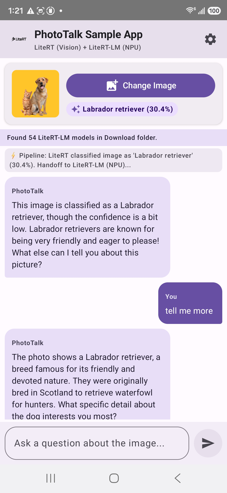

# **PhotoTalk Sample App: Co-dependent LiteRT & LiteRT-LM Sample**

**PhotoTalk Sample App** is an Android sample application demonstrating the side-by-side co-dependent integration of **LiteRT** (for classic machine learning image classification) and **LiteRT-LM** (for Large Language Model orchestration).

---

## **Architecture & Co-dependency Pattern**

On-device Vision Language Models (VLMs) can be memory-intensive on mobile devices. **PhotoTalk Sample App** uses an efficient two-stage pipeline to achieve interactive image-based conversation with minimal latency and memory footprint:

```
┌──────────────────────────┐
│   User Image / Photo     │
└────────────┬─────────────┘
             │
             ▼
┌──────────────────────────┐
│  LiteRT (CompiledModel)  │ ◄── EfficientNet-Lite0 Image Classifier (TFLite)
└────────────┬─────────────┘
             │
             │ Extracted Label (e.g. "Electric Guitar", 94%)
             ▼
┌──────────────────────────┐
│        Prompting         │ ◄── Context handoff: "User uploaded photo of [Label]..."
└────────────┬─────────────┘
             │
             ▼
┌──────────────────────────┐
│   LiteRT-LM (Engine)     │ ◄── On-Device LLM (Gemma 3 / Gemma 4 / FastVLM)
└────────────┬─────────────┘
             │
             ▼
┌──────────────────────────┐
│ Interactive Chat Session │ ◄── Concise, interactive multi-turn Q&A about the image
└────────────┬─────────────┘
```

1. **LiteRT (Image Classification)**: Uses the LiteRT `CompiledModel` API with **EfficientNet-Lite0** (`efficientnet_lite0.tflite`) to classify an uploaded image and extract the top detected object label.
2. **Context Handoff**: The detected label and confidence score are injected into the system instruction for LiteRT-LM.
3. **LiteRT-LM (Interactive Chat)**: Creates a hardware-accelerated `Conversation` session (supporting NPU, GPU, or CPU). The LLM greets the user with concise insights about the identified object and streams interactive multi-turn answers.

---

## **Hardware Acceleration Backends**

PhotoTalk supports multiple hardware execution backends selectable in real-time from the in-app **Settings (⚙️)**:

| Backend | Accelerator | Description | Best Suited Models |
|:---|:---|:---|:---|
| **NPU** | Qualcomm Hexagon NPU (HTP) | Direct hardware acceleration via Qualcomm QNN HTP dispatch runtime. | AOT-compiled `.litertlm` models (e.g., `gemma-4-E2B-it_qualcomm_sm8750.litertlm`, `Gemma3-1B-IT_q4_ekv1280_sm8750.litertlm`, `FastVLM-0.5B.sm8750.litertlm`) |
| **GPU** | Mobile GPU (OpenCL / Vulkan) | Low-latency compute shaders across mobile GPU execution units. | `gemma-4-E2B-it.litertlm`, `Gemma3-1B-IT` |
| **CPU** | Multi-threaded CPU (XNNPACK) | Portable execution using XNNPACK CPU acceleration. | Universal compatibility across all Android devices |

---

## **Supported Model Zoo**

PhotoTalk automatically scans your device's `/sdcard/Download/` folder for compatible `.litertlm` models. Supported model families include:

| Model Family | Quantization | Target Hardware | Source |
|:---|:---:|:---|:---|
| **Gemma 4 (2B)** | 4-bit | NPU, GPU, CPU | [Hugging Face (litert-community)](https://huggingface.co/litert-community/gemma-4-E2B-it-litert-lm) |
| **Gemma 3 (1B / 270M)** | 4-bit / 8-bit | NPU, GPU, CPU | [Hugging Face (litert-community)](https://huggingface.co/litert-community/Gemma3-1B-IT) |
| **FastVLM (0.5B)** | 4-bit | NPU, GPU, CPU | [Hugging Face (litert-community)](https://huggingface.co/litert-community/FastVLM-0.5B) |

---

## **Screenshots**

| LiteRT-LM Configuration Settings | NPU Accelerator Inference | GPU Accelerator Inference | CPU Accelerator Inference |
|:---:|:---:|:---:|:---:|
|  |  |  |  |

---

## **Vision Classification Model: EfficientNet-Lite0**

The image classification component uses **EfficientNet-Lite0** (`efficientnet_lite0.tflite`):

* **Model Family**: EfficientNet-Lite (developed by Google AI) optimized for edge and mobile hardware acceleration.
* **Input Resolution**: `224x224x3` RGB pixels normalized between `[-1.0, 1.0]`.
* **Dataset**: Pretrained on ImageNet-1k (1,000 object categories).
* **Automatic Download**: Downloaded automatically during build via the Gradle task `downloadEfficientnetLite0Model` (`download_model.gradle`).
* **Execution**: Executed through LiteRT's `CompiledModel` API (`com.google.ai.edge.litert.CompiledModel`) with GPU acceleration and CPU fallback.

---

## **Project Structure**

```
phototalk_sample_app/
├── README.md
├── output/                              # Screenshots (settings.jpg, NPU.jpg, GPU.jpg, CPU.jpg)
└── android/
    ├── app/
    │   ├── build.gradle.kts
    │   ├── download_model.gradle        # Automated download for EfficientNet-Lite0
    │   └── src/main/
    │       ├── AndroidManifest.xml
    │       ├── res/                     # Resources & LiteRT branding
    │       └── java/com/google/aiedge/examples/phototalk/
    │           ├── MainActivity.kt
    │           ├── MainViewModel.kt
    │           ├── ImageClassifierHelper.kt  # LiteRT CompiledModel classifier
    │           ├── LiteRtLmHelper.kt         # LiteRT-LM Engine & Conversation manager
    │           └── ui/                       # Jetpack Compose UI (PhotoTalkAppScreen.kt)
    ├── download_npu_libs.sh             # Helper script to dynamically download NPU runtime libs
    ├── build.gradle.kts
    ├── settings.gradle.kts
    └── gradle/libs.versions.toml        # Centralized dependency versions
```

---

## **Developer Setup & Getting Started**

### **1. Prerequisites**
* Android Studio (Ladybug 2024.2.1+ or newer)
* Android device with **Android 8.0+ (API 26+)** (for NPU: Snapdragon 8 Gen 2 / 3 / Elite or compatible chipsets)
* Android SDK & NDK installed

---

### **2. Setup NPU Runtime Libraries (Optional for Qualcomm NPU)**
If you want to run LiteRT-LM with NPU hardware acceleration on Qualcomm devices, run the provided helper script:

```bash
cd samples/litert/phototalk_sample_app/android
bash download_npu_libs.sh
```

* The script automatically reads the current LiteRT version configured in `gradle/libs.versions.toml` and fetches the matching Qualcomm QAIRT / QNN runtime libraries.
* You can also specify an explicit version or Hexagon target architecture (e.g. `79` for SM8750 / Snapdragon 8 Elite, `75` for SM8650 / Snapdragon 8 Gen 3, `73` for SM8550):
  ```bash
  # Usage: bash download_npu_libs.sh [LITERT_VERSION] [HEXAGON_ARCH]
  bash download_npu_libs.sh 2.2.0 79
  ```

> **Note**: Native `.so` libraries are excluded from Git via `.gitignore`. Running `download_npu_libs.sh` prepares them locally for build.

---

### **3. Download and Push a `.litertlm` Model to the Device**
Download your preferred on-device LLM from [Hugging Face](https://huggingface.co/litert-community) and push it to your device's `/sdcard/Download/` directory:

```bash
adb push <path_to_model>.litertlm /sdcard/Download/
```

*Example models:*
* **Gemma 4 (NPU / GPU / CPU)**: `adb push gemma-4-E2B-it_qualcomm_sm8750.litertlm /sdcard/Download/` (or `gemma-4-E2B-it.litertlm`)
* **Gemma 3 (NPU / GPU / CPU)**: `adb push Gemma3-1B-IT_q4_ekv1280_sm8750.litertlm /sdcard/Download/`
* **FastVLM (NPU / GPU / CPU)**: `adb push FastVLM-0.5B.sm8750.litertlm /sdcard/Download/`

---

### **4. Build & Install the Application**

```bash
cd samples/litert/phototalk_sample_app/android
./gradlew installDebug
```

---

### **5. Running the App**
1. Launch **PhotoTalk Sample App** on your phone.
2. Tap the **Settings (⚙️)** icon in the top right.
3. Select your model file and preferred accelerator backend (**NPU**, **GPU**, or **CPU**).
4. Tap **Initialize Engine**.
5. Once the banner shows **`LiteRT-LM Ready`**, tap **Select Image** to upload a photo and start chatting!

---

## **Troubleshooting**

* **Model Not Detected**: Verify the `.litertlm` model is in `/sdcard/Download/`. You can also tap **Browse Device Files** in Settings to select a model from any local storage folder.
* **NPU Initialization**: Ensure you executed `bash download_npu_libs.sh` and selected an AOT-compiled model matching your device's SoC architecture.
* **GPU Acceleration**: GPU mode provides hardware-accelerated inference across supported devices without requiring additional vendor libraries.
