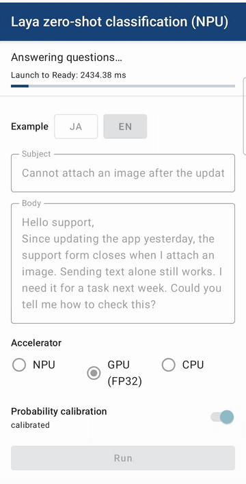
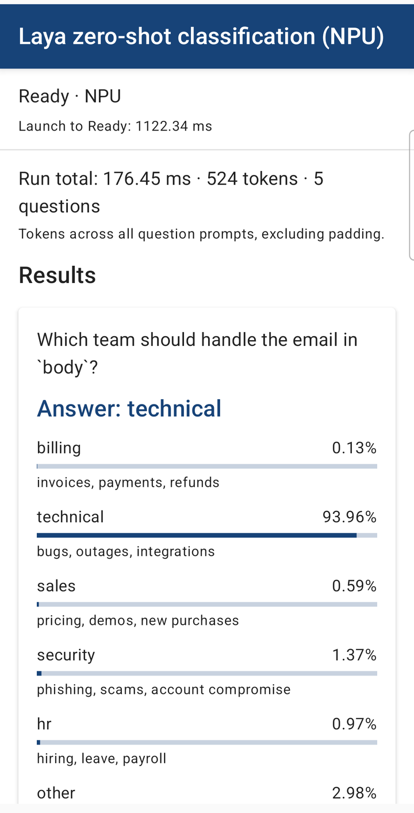
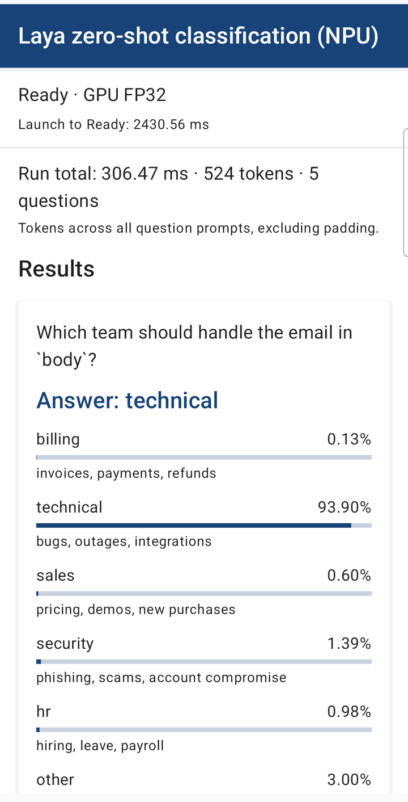

# Laya zero-shot classification on the NPU

The Android app from [`kotlin_cpu_gpu/android`](../../kotlin_cpu_gpu/android) with one more accelerator: the encoder runs on the Qualcomm NPU through the [LiteRT](https://github.com/google-ai-edge/litert) Compiled Model API ([LiteRT NPU](https://ai.google.dev/edge/litert/next/npu)). LiteRT compiles the graph for the NPU on the phone the first time and caches the result in the app's cache folder. The GPU (FP32) and CPU choices stay in the app.

The NPU computes in FP16. The graph this app downloads, from revision `32f1b84d` of [litert-community/Laya-Multilingual-LiteRT](https://huggingface.co/litert-community/Laya-Multilingual-LiteRT), scales its large activations by powers of two and uses a -1e4 attention mask, so FP16 stays finite; in FP32 it computes the same values as the graph the CPU/GPU app uses.

| GPU, then the NPU | Launch on the NPU | Launch on the GPU (FP32) |
|---|---|---|
|  |  |  |

On screen: the app's English example (524 tokens), one run each; the recording plays at 1.5x, and its switch to the NPU read LiteRT's compile cache, while the first launch on a phone compiles for about a minute. The Performance table below measures the Japanese example (529 tokens).

## Set up the NPU runtime

Do this before any Gradle command: the build includes the runtime modules. The NPU runtime is Qualcomm's and is not in this repository. From this folder, put the LiteRT v2.2.0 release asset under `litert_npu_runtime_libraries/` and let its script add the Qualcomm AI Runtime libraries (a 2.3 GB download; the script uses `wget` and `unzip`):

```sh
curl -LO https://github.com/google-ai-edge/LiteRT/releases/download/v2.2.0/litert_npu_runtime_libraries_jit.zip
unzip litert_npu_runtime_libraries_jit.zip -d litert_npu_runtime_libraries
./litert_npu_runtime_libraries/fetch_qualcomm_library.sh
```

The runtime version has to match the LiteRT version in `gradle/libs.versions.toml` (2.2.0).

## Build and install

The runtime ships as one install-time module per supported Qualcomm SoC (device group), so the app is built as a bundle and installed with [bundletool](https://github.com/google/bundletool/releases) for your phone's group:

```sh
./gradlew bundle
java -jar bundletool-all.jar build-apks --bundle=app/build/outputs/bundle/release/app-release.aab --output=zero_shot.apks --local-testing --overwrite
java -jar bundletool-all.jar install-apks --apks=zero_shot.apks --device-groups=Qualcomm_SM8850
```

| SoC | Group name |
|---|---|
| SM8550 | `Qualcomm_SM8550` |
| SM8650 | `Qualcomm_SM8650` |
| SM8750 | `Qualcomm_SM8750` |
| SM8850 | `Qualcomm_SM8850` |

Tested on a Galaxy S26 (SM8850). The other three groups are included because LiteRT 2.2.0 lists their SoCs; they are not tested. Installed without the runtime module (for example with `./gradlew installDebug`), the app disables the NPU choice and runs on the GPU or the CPU. The app has its own application id, so it installs next to the CPU/GPU app; its first launch downloads the model files (679 MB).

## Check on the device

The on-device check runs the 201 published reference rows on the NPU, the GPU and the CPU. LiteRT 2.2.0 runs the graph on the CPU when its NPU compile fails, so the NPU test also requires LiteRT's log line that the whole graph went to the NPU. The check needs the debug bundle, installed the same way:

```sh
./gradlew bundleDebug :app:assembleDebugAndroidTest
java -jar bundletool-all.jar build-apks --bundle=app/build/outputs/bundle/debug/app-debug.aab --output=zero_shot_debug.apks --local-testing --overwrite
java -jar bundletool-all.jar install-apks --apks=zero_shot_debug.apks --device-groups=Qualcomm_SM8850
adb install -t app/build/outputs/apk/androidTest/debug/app-debug-androidTest.apk
adb shell am instrument -w -e class com.google.ai.edge.examples.zero_shot_classification.ModelParityTest com.google.ai.edge.examples.zero_shot_classification.npu.test/androidx.test.runner.AndroidJUnitRunner
adb shell am instrument -w -e class com.google.ai.edge.examples.zero_shot_classification.ModelParityTest#npuAfterGpu com.google.ai.edge.examples.zero_shot_classification.npu.test/androidx.test.runner.AndroidJUnitRunner
```

The second line runs one check in a fresh process: LiteRT 2.2.0 starts the NPU runtime once per process, from the options of the first graph compiled in it, so the app compiles every graph, GPU and CPU ones too, with the NPU performance mode. Without that, switching from the GPU to the NPU in the app leaves the NPU about five times slower than a launch on the NPU.

## Performance

| Galaxy S26, LiteRT 2.2.0, release build | NPU | GPU (FP32) |
|---|---|---|
| Launch to Ready | 1.1 s | 2.4 s |
| Five questions (the email preset, 529 tokens) | 0.19 s | 0.30 s |

Launch to Ready includes loading the tokenizer and the model, compiling, and a warm-up pass; on the NPU the compile read LiteRT's cache. The first launch on a phone compiles for the NPU for about a minute (69 s in the on-device check); later launches read the cache (0.2 to 0.3 s). In the on-device check (debug build, 201 rows), one question takes 33 ms on the NPU, 53 ms on the GPU and 244 ms on the CPU (medians). All three give the same top answer as the official laya 0.3.4 on the 81 choice and score questions; the largest probability difference is 0.0069 on the NPU and 0.0014 on the GPU and the CPU. The NPU runs with the BURST performance mode.
