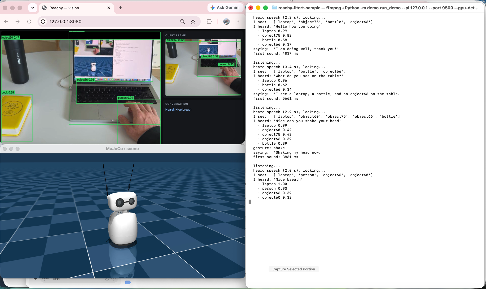
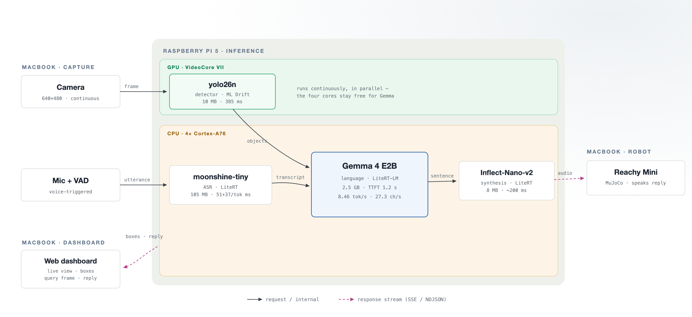

# Reachy voice robot — the whole see–hear–reason–speak loop on one Raspberry Pi

A small desk robot you talk to. It **sees** through a camera, **hears** you, **reasons**
about what you said (and, if you ask, what it sees), and **speaks** a reply — with every
model running **on-device on a Raspberry Pi**, entirely on the **LiteRT** stack.

Four models cover the loop: an object detector on the Pi's **GPU**, and speech-to-text, a
language model, and speech synthesis on its CPU cores. First audio reaches you in
**~2.7–3.1 s** once warmed up, three-quarters of which is the language model.



*The live dashboard shows the camera with GPU detection boxes, the frame captured for the
last question, and the conversation; the Reachy Mini robot runs in the MuJoCo simulator;
the pipeline log prints each turn — objects seen, transcript, reply, and first-sound
latency.*

---

## What this sample demonstrates

- **A complete multimodal on-device pipeline** — vision + ASR + LLM + TTS — on a Pi, no cloud.
- **The full LiteRT stack in one app:** vision, speech-to-text and synthesis on
  [`ai-edge-litert`](https://pypi.org/project/ai-edge-litert/) (LiteRT), and the language
  model on [`litert-lm`](https://github.com/google-ai-edge/LiteRT-LM) — a single on-device
  runtime, end to end.
- **GPU offload done right:** the detector runs on the VideoCore VII via LiteRT's ML Drift
  (WebGPU → `v3dv`) **for parallelism, not speed** — it frees the CPU cores for the LLM.
- **Pluggable I/O:** the same voice loop runs with a Mac driving the robot **or** standalone
  on the robot's own Pi, behind a small `Platform` protocol.
- **Latency-aware prompting:** the whole prompt is held under a measured prefill cliff, and
  the reply is streamed and synthesized sentence-by-sentence so the robot starts speaking early.

## Hardware & software

- **Reference hardware** (what the numbers below were measured on): Raspberry Pi 5, 8 GB · quad-core Arm Cortex-A76 · Debian 12 · Python 3.12
- **Runtimes:** LiteRT (`ai-edge-litert`) 2.1.6 (+ ML Drift GPU backend) · LiteRT-LM 0.15.0
- **Footprint:** ~2.6 GB of model files, ~2.4 GB resident (of 8 GB)
- **GPU path (optional):** a recent `v3dv` Vulkan driver with `V3D_WEBGPU_OVERRIDE` set (see Quickstart) — Raspberry Pi OS **Trixie+**, or Mesa from `main` on Bookworm.
- **Robot (optional):** a [Reachy Mini](https://www.pollen-robotics.com/) — or its MuJoCo
  simulator on a Mac (no hardware needed)

The Python side is managed with [`uv`](https://docs.astral.sh/uv/).

---

## Architecture

The pipeline runs entirely on the Pi. In the bench setup a Mac captures camera + microphone
and streams a live dashboard; the same code also runs **standalone on the robot's Pi**, where
the robot itself provides eyes, ears, and mouth.



1. **Continuously:** camera frames go to the Pi, where an **Ultralytics YOLO26** detector
   (`yolo26n`) detects objects on the **GPU**; the boxes stream to a live web dashboard.
2. **On an utterance:** the microphone audio + the latest GPU detections are sent (the frame is
   not re-sent — the scene is already current).
3. **`moonshine-tiny`** transcribes the speech.
4. **`Gemma 4 E2B`** reads the transcript (plus the detected objects, only when the person asks
   about the scene) and **streams** the reply sentence by sentence.
5. **`Inflect-Nano-v2`** synthesizes each sentence on LiteRT.
6. The reply audio streams back as NDJSON; the robot speaks it, and the reply text streams to
   the dashboard.

## The models

The pipeline is defined by four roles — vision, speech-to-text, reasoning, and synthesis — and
each is swappable by name in one catalog (`emulator/models.py`). The defaults below were each
chosen against measured alternatives on a Raspberry Pi; the constant trade is accuracy against
latency and memory bandwidth, since the whole loop must run near-real-time on the CPU cores plus
the GPU: Whisper computes a full
30 s window even for a one-second reply; smaller Gemmas gave the same wall-clock (decode is
memory-bandwidth-bound).

Defaults (swap any one by editing its name in the catalog):

| Stage | Model | Size | Runtime | Why |
|---|---|---|---|---|
| Vision | **yolo26n** (Ultralytics YOLO26) | 10 MB | LiteRT · ML Drift (GPU) | exported with the raw head (`end2end=False`) so it runs fully on the V3D GPU; 385 ms/frame there |
| Speech-to-text | **moonshine-tiny** | 105 MB | LiteRT | 5 s window matches an utterance (Whisper computes a full 30 s) |
| Language model | **Gemma 4 E2B** | 2.5 GB | LiteRT-LM | most useful output per second (27.3 chars/s); fits 8 GB at ~2.1 GB RSS |
| Synthesis | **Inflect-Nano-v2** | 8 MB | LiteRT | on LiteRT, bit-exact vs PyTorch, streams within a sentence |

## End-to-end budget to the first spoken sentence (reference Pi)

The robot starts speaking at the **first finished sentence**, not after the whole reply. These
are the per-stage compute times on the path to that first sound:

| Stage | Model | Time | Share |
|---|---|---|---|
| Speech-to-text | moonshine-tiny | 387 ms | 15.8% |
| Language model | Gemma 4 E2B | 1850 ms | 75.6% |
| Synthesis | Inflect-Nano-v2 | 210 ms | 8.6% |
| **To first sentence** | | **2447 ms** | 100% |

Object detection is **not** on this path: it runs continuously on the GPU, so the scene is
already known when the question arrives. The **~2447 ms** above is model compute; measured live
(warmed up, detector on the GPU), first sound lands at **~2.7–3.1 s** once microphone capture, VAD,
network and audio buffering are added — a cold first turn (models just loaded, or the detector on
the CPU) is roughly 2×. The reply keeps streaming after that first sentence — the full answer runs
~6 s at ~27 chars/s — but the person is already hearing the robot talk.

---

## Quickstart

### 1. Install

```bash
pip install -r requirements.txt      # or, with uv:  uv sync
```

The **speech-to-text** and the **synthesizer** (Inflect-Nano-v2) models auto-download from
Hugging Face on first use (the `assets/` weights are git-ignored; see `assets/inflect/RUN.md`
for the synthesizer). The **detector** (Ultralytics YOLO26) is exported once into `assets/yolo/`
— see `assets/yolo/README.md`. The **language model must be imported into LiteRT-LM once** (see
step 2) — `litert-lm serve` only serves already-imported models. The GPU
detector additionally needs a recent v3dv Vulkan driver with `V3D_WEBGPU_OVERRIDE` set — Raspberry
Pi OS Trixie+, or Mesa from `main` on Bookworm. Without it, skip the detector service (see step 2).

### 2. Run standalone on the robot's Pi

With a Reachy Mini, the whole loop runs on the robot itself — camera, mic, and speaker come
from the robot's own SDK:

```bash
# One-time: import the Gemma model into LiteRT-LM under the id "e2b" — the name
# emulator/models.py requests. (litert-lm serve only serves imported models.)
litert-lm import --from-huggingface-repo litert-community/gemma-4-E2B-it-litert-lm \
                 gemma-4-E2B-it.litertlm e2b

# On the Pi: start the language model and the pipeline server
litert-lm serve --host 127.0.0.1 --port 9379
python -m demo.serve --host 127.0.0.1 --port 9500

# The GPU detector runs the detector on the GPU and needs a recent v3dv driver.
# Point VK_ICD_FILENAMES at its ICD json — on Raspberry Pi OS the stock driver is
# /usr/share/vulkan/icd.d/broadcom_icd.aarch64.json (Trixie+; on Bookworm build
# Mesa from main). Without a working v3dv driver, gpu_detect cannot init.
VK_ICD_FILENAMES=/usr/share/vulkan/icd.d/broadcom_icd.aarch64.json V3D_WEBGPU_OVERRIDE=1 \
  python -m demo.gpu_detect --host 127.0.0.1 --port 9600

# Then the voice loop, using the robot as the I/O platform. Drop --gpu-detect-port
# to skip the GPU detector — the pipeline server then detects on the CPU per turn.
python -m demo.run_demo --platform reachy --pi 127.0.0.1 --port 9500 --gpu-detect-port 9600
```

> **Security:** the pipeline and detector HTTP endpoints are unauthenticated. Keep them bound to
> `127.0.0.1` (the split-mode script below reaches them over an SSH tunnel); do not expose them on
> `0.0.0.0` on an untrusted network.

### 3. Run split: a Mac drives, the Pi computes

Handy for development — the Mac captures and shows the dashboard while the Pi does all the
inference (the robot runs in the MuJoCo simulator). The provided script brings up the Pi
services over SSH and starts the demo:

> The MuJoCo sim (`./demo/robot.sh`) needs the robot SDK on the Mac: `pip install reachy_mini mujoco`.
> Point `launch.sh` at your Pi with environment variables — see the header of `demo/launch.sh` for
> `PI`, `REMOTE_USER`, `SSH_PORT`, `SSH_KEY`, `PI_REPO`, and `V3D_ICD` (path to your v3dv ICD json for
> the GPU detector; leave it unset to run without the detector).

```bash
# Terminal 1 — the robot (MuJoCo sim); keep this window open
./demo/robot.sh

# Terminal 2 — Pi services + the voice loop + the dashboard at http://127.0.0.1:8080
PI=<pi-host> ./demo/launch.sh
#   ./demo/launch.sh --no-robot   # console robot, no sim window, single terminal
```

Talk to the robot; `Ctrl-C` stops the Mac side. The Pi services are `systemd --user` units, so
a second launch is fast.

### Configuration

- `--platform mac|reachy` — capture/playback backend (Mac ffmpeg + MuJoCo sim, or the robot SDK)
- `--display web|none` — the live dashboard (MJPEG + SSE) or headless
- `--pi <host>`, `--port`, `--gpu-detect-port` — where the Pi services listen
- `--video <index>`, `--audio <index>` — Mac camera/mic device indices (`--platform mac`); list
  them with `ffmpeg -f avfoundation -list_devices true -i ""` and pass the right ones (on many
  Macs the built-in mic is `0`, not the default `1`)

---

## Repository layout

```
emulator/   the inference pipeline: detector, ASR, LLM client, TTS, model loading, timeline
demo/       the app: HTTP servers (serve, gpu_detect), the voice loop, platform I/O, web dashboard
  platform/   pluggable I/O backends — mac.py (ffmpeg + MuJoCo) and reachy.py (robot SDK)
  display/    pluggable output sink — web.py (dashboard) and a null sink
tests/      the test suite (pytest)
docs/       figures
```

## Measurements

All figures above are medians after warmup on the Pi 5, each captured with a throttling snapshot
per run (peak load acceptance: 3 min all-core, 71.9 °C, clock held at 2400 MHz,
`get_throttled = 0x0`).

## License

Apache License 2.0 — see the `LICENSE` file at the root of this repository.
